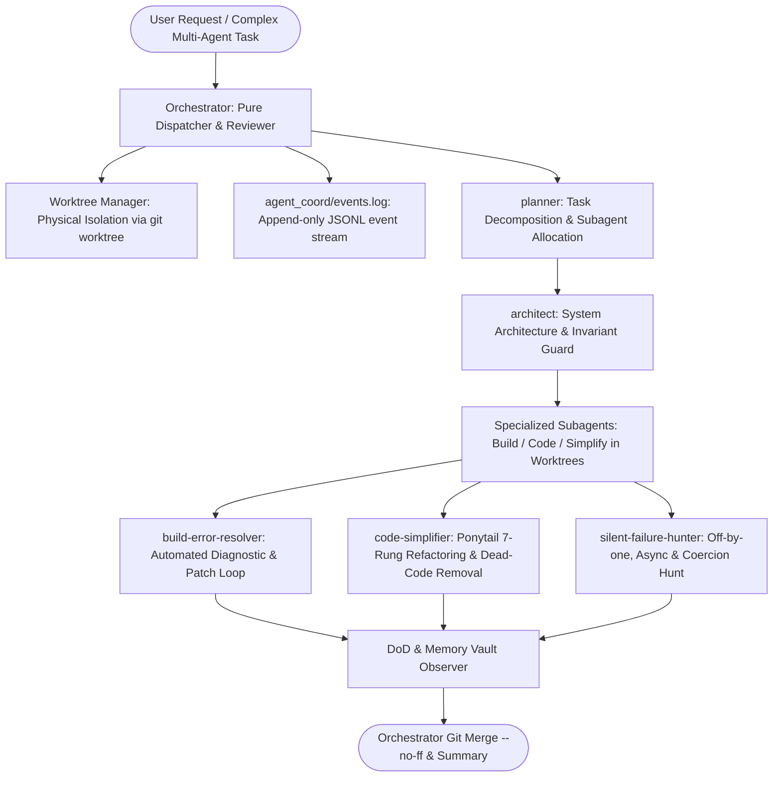

# Autonomous Agentic Master Suite Workflow

**MANDATE**: Orchestrate concurrent autonomous AI agents with zero race conditions, zero context amnesia, zero AI writing fluff, and pure senior-engineer Ponytail minimalism.

---

## 1. Multi-Agent Coordination Topology



| Subagent Role | Target Domain | Core Responsibility |
|---------------|---------------|---------------------|
| `planner` | Task Strategy | Break tasks into independent, parallelizable units |
| `architect` | System Design | Enforce invariants, causal constraints, and boundaries |
| `build-error-resolver` | Diagnostics | Resolve TypeScript, compiler, or build failures within 3 strikes |
| `code-simplifier` | Code Hygiene | Apply Ponytail 7-rung ladder, strip speculative abstractions |
| `silent-failure-hunter` | Correctness | Detect unhandled promises, type coercion, and off-by-one errors |

---

## 2. Step-by-Step Execution Lifecycle

### Step 1: Worktree Physical Isolation
1. **Never edit files in shared branch**: Each active subagent operates within its own dedicated git worktree.
2. **Worktree Creation**:
   ```bash
   git worktree add ../work-agent-planner -b agent/planner-task
   git worktree add ../work-agent-impl -b agent/impl-task
   ```
3. **No File Locking**: Git algorithm handles atomic branch merges at the conclusion of tasks.

### Step 2: Append-Only Event Log (`events.log`)
Subagents announce state transitions by appending JSONL entries to `agent_coord/events.log`:
```jsonl
{"ts":"2026-09-18T10:00:00Z","agent":"planner","event":"PLAN_READY","slices":["db","api","ui"]}
{"ts":"2026-09-18T10:05:00Z","agent":"impl-db","event":"SLICE_DONE","slice":"db","status":"success"}
```

### Step 3: SQLite FTS5 Memory Vault & False Memory Guard
1. **Memory Storage**: Centralized SQLite database at `~/.claude/memory/vault/antigravity.db` with FTS5 search.
2. **False Memory Guard**:
   - Habits/preferences require $\ge 3$ verified user mentions before promotion to permanent memory.
   - Propose memory updates explicitly: `[PROPOSED MEMORY UPDATE] Approve? [Y/N]`.

### Step 4: Ponytail 7-Rung Solution Ladder (Every Subagent)
Before writing any line of code, halt at the first rung that holds:
1. **YAGNI**: Does this need to exist at all?
2. **Existing**: Does it already exist in the codebase?
3. **Stdlib**: Does standard library provide it?
4. **Native**: Does CSS / SQL / OS feature cover it?
5. **Installed**: Does an existing dependency solve it?
6. **One-Liner**: Can it be written in a single concise line?
7. **Minimum Code**: Shortest working diff wins.

*Mark deliberate simplifications with:* `// ponytail: <ceiling>, <upgrade path>`

### Step 5: Stealth Human Identity (Anti-AI Signature)
Enforce the 33 Human Identity guidelines across all comments, commit messages, and documentation:
- **No AI Buzzwords**: Banned words (`delve`, `crucial`, `testament`, `tapestry`, `landscape`, `pivotal`, `fostering`, `vibrant`).
- **No Copula Avoidance**: Use simple copulas (`is`, `are`, `has`) instead of `boasts`, `features`, `serves as`.
- **No Em Dashes**: Zero `—` dashes; use commas, periods, or parentheses.
- **Dry Senior Tone**: Direct, active voice, zero sycophantic filler ("Certainly!", "Let's explore!").

### Step 6: 3-Strike Circuit Breaker
If the same error signature repeats 3 times consecutively:
- **STOP immediately**.
- Propose root cause hypotheses and request user intervention. Never loop infinitely.

---

## 3. Definition of Done (DoD) Checklist

- [ ] All subagent tasks executed in physically isolated Git Worktrees.
- [ ] `agent_coord/events.log` maintained with append-only JSONL entries.
- [ ] Ponytail 7-rung solution ladder verified (zero unrequested abstractions).
- [ ] Human identity verified (zero banned words, straight quotes, no em dashes).
- [ ] Memory updates gated by False Memory Guard ($\ge 3$ confirms).
- [ ] `python scripts/safety_guard.py --scan-file .` clean with 0 secrets.
- [ ] Subagents signed off (`planner`, `architect`, `code-simplifier`, `silent-failure-hunter`).
