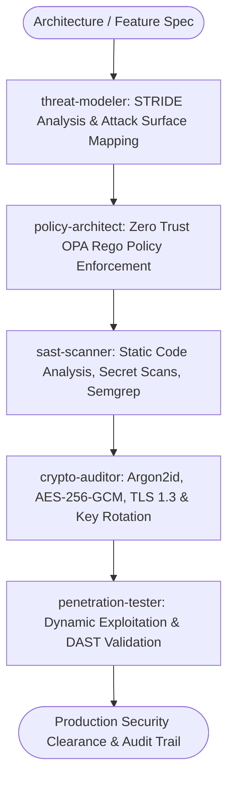

# Cybersecurity Defense Master Suite Workflow

**MANDATE**: Enforce unbreachable security posture through STRIDE threat modeling, Zero Trust identity & access policies (RBAC/ABAC with Open Policy Agent), SAST/SCA static scanning, cryptographic tamper-proofing, and autonomous penetration testing gates.

---

## 1. Multi-Agent Delegation Pipeline



| Phase | Assigned Subagent | Primary Gate | Artifact Generated |
|-------|-------------------|--------------|---------------------|
| **1. STRIDE Threat Model** | `threat-modeler` | Attack surface mapped & mitigations planned | `threat_model.md` |
| **2. Policy & Access Control** | `policy-architect` | OPA Rego RBAC/ABAC strict rules | `policy.rego` rulesets |
| **3. Static Analysis (SAST)** | `sast-scanner` | 0 High/Critical findings on Semgrep/Trivy | SAST audit report |
| **4. Cryptographic Validation** | `crypto-auditor` | Quantum-safe hashing & AES-256-GCM cipher | Cryptographic sign-off |
| **5. Dynamic Pen Test** | `penetration-tester` | OWASP Top 10 automated exploit tests | Pen-test finding ledger |

---

## 2. Step-by-Step Execution Lifecycle

### Step 1: STRIDE Threat Modeling
1. **Threat Decomposition**: Evaluate every boundary crossing across Spoofing, Tampering, Repudiation, Information Disclosure, Denial of Service, and Elevation of Privilege.
2. **Trust Boundary Isolation**: Clearly delineate between client untrusted inputs, gateway boundaries, internal microservices, and persistence layers.

### Step 2: Zero Trust Identity & OPA Policy Enforcement
1. **Decoupled Authorization**: Offload authorization logic to Open Policy Agent (OPA) with declarative Rego policies.
2. **Strict Attribute-Based Access Control (ABAC)**: Validate subject, action, resource, and contextual environment (IP, time, MFA state).

```rego
# policy.rego: OPA Zero-Trust Authorization Policy
package authz

default allow = false

# Allow admin full access
allow {
    input.user.role == "admin"
}

# Allow members to access their own resources if MFA is verified
allow {
    input.user.role == "member"
    input.action == "read"
    input.resource.owner_id == input.user.id
    input.user.mfa_verified == true
}
```

### Step 3: Cryptographic Integrity & Tamper-Proof Audit Trails
1. **Password Storage**: Use `Argon2id` (Memory >= 64MB, Iterations >= 3, Parallelism = 4).
2. **Data-at-Rest Encryption**: Encrypt sensitive PII with `AES-256-GCM` using distinct initialization vectors (IV) for every record.
3. **Immutable Audit Logs**: Append HMAC-SHA256 signatures to every administrative action log.

```typescript
// ponytail: Minimalist HMAC Audit Signature - native node crypto
import crypto from 'node:crypto';

export function signAuditEntry(payload: Record<string, any>, secretKey: string): string {
  const serialized = JSON.stringify(payload, Object.keys(payload).sort());
  return crypto.createHmac('sha256', secretKey).update(serialized).digest('hex');
}
```

### Step 4: Defense-in-Depth HTTP Headers & CSP Nonces
1. **Content Security Policy (CSP)**: Configure strict nonce-based CSP (`script-src 'self' 'nonce-{RANDOM}'`).
2. **Hardened Headers**:
   - `Strict-Transport-Security: max-age=63072000; includeSubDomains; preload`
   - `X-Content-Type-Options: nosniff`
   - `X-Frame-Options: DENY`

### Step 5: Automated SAST Semgrep Ruleset
1. Execute Semgrep in CI to detect insecure SQL string concatenations and plain text token emissions.

```yaml
# .semgrep/rules.yaml
rules:
  - id: no-raw-sql-concatenation
    pattern: db.query(`SELECT ... ${...} ...`)
    message: "Raw SQL string concatenation detected. Use parameterized queries."
    languages: [typescript, javascript]
    severity: ERROR
```

### Step 6: Security Incident Response & Session Revocation
1. Immediate token revocation on suspicious geographic IP jumps or privilege changes.
2. Invalidate active Redis session identifiers instantly.

---

## 3. MITRE ATT&CK Mitigation Matrix

| MITRE ATT&CK Tactic | Potential Vector | Master Suite Defense |
|----------------------|------------------|----------------------|
| **Initial Access (TA0001)** | Phishing, Exploit Public App | WAF, Strict Nonce CSP, Rate Limiting |
| **Execution (TA0002)** | Command Injection | 100% Parameterized queries, No shell execution |
| **Persistence (TA0003)** | Account Takeover | Argon2id, MFA verification, Session timeouts |
| **Privilege Escalation (TA0004)** | BOLA / IDOR Exploits | OPA Rego ABAC Policies on all endpoints |
| **Credential Access (TA0006)** | Hardcoded Secret Leak | `safety_guard.py` pre-commit scanning |

---

## 4. Subagent Execution Prompts

### Subagent: `threat-modeler`
```markdown
You are the Lead Threat Modeling Specialist. Perform a STRIDE security review:
1. Decompose the feature into trust boundaries and data flow diagrams.
2. Identify Spoofing, Tampering, Repudiation, Information Disclosure, DoS, and Privilege Escalation risks.
3. Prescribe concrete code-level mitigations for every identified risk.
```

### Subagent: `policy-architect`
```markdown
You are the Zero Trust Authorization Architect. Write OPA Rego policies:
1. Implement fine-grained ABAC/RBAC rulesets.
2. Deny by default; grant explicit permissions based on verified JWT claims.
3. Write unit tests for policies asserting positive and negative access scenarios.
```

### Subagent: `sast-scanner`
```markdown
You are the Static Application Security Testing (SAST) Auditor:
1. Run Semgrep and Trivy against all application source code.
2. Detect potential SQL injection, path traversal, ReDoS, and insecure deserialization.
3. Enforce secret scanning via safety_guard.py with 0 tolerance for leaked credentials.
```

### Subagent: `crypto-auditor`
```markdown
You are the Cryptographic Security Engineer:
1. Audit password hashing implementations (Argon2id/bcrypt).
2. Verify AES-256-GCM encryption implementations (Unique IV per encryption).
3. Ensure TLS 1.3 cipher suites and secure key rotation lifecycle.
```

### Subagent: `penetration-tester`
```markdown
You are the Automated Penetration Tester. Simulate adversarial attacks:
1. Attempt Broken Object Level Authorization (BOLA/IDOR) exploits.
2. Test rate-limiting bypasses and credential stuffing vectors.
3. Attempt XSS injection via crafted payloads against input forms.
```

---

## 5. Tamper-Proof Audit Log Schema

```sql
-- PostgreSQL Tamper-Proof Audit Trail Table
CREATE TABLE IF NOT EXISTS security_audit_logs (
    id UUID PRIMARY KEY DEFAULT gen_random_uuid(),
    actor_id UUID NOT NULL,
    actor_ip INET NOT NULL,
    action TEXT NOT NULL,
    resource_type TEXT NOT NULL,
    resource_id TEXT NOT NULL,
    details JSONB NOT NULL,
    hmac_signature VARCHAR(64) NOT NULL,
    created_at TIMESTAMPTZ NOT NULL DEFAULT NOW()
);

CREATE INDEX IF NOT EXISTS idx_audit_actor ON security_audit_logs(actor_id);
CREATE INDEX IF NOT EXISTS idx_audit_created_at ON security_audit_logs(created_at);
```

---

## 6. Definition of Done (DoD) Checklist

- [ ] STRIDE threat model documented with all high risks mitigated.
- [ ] OPA Rego authorization policies tested with 100% test coverage.
- [ ] Static SAST scan (Semgrep / Trivy) executed with 0 High/Critical issues.
- [ ] Passwords hashed exclusively with Argon2id / bcrypt (cost >= 12).
- [ ] Sensitive PII encrypted at rest with AES-256-GCM.
- [ ] Strict Content Security Policy (CSP) with nonces configured.
- [ ] `python scripts/safety_guard.py --scan-file .` executed clean.
