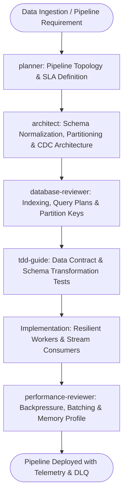

# Data Engineering & High-Throughput Pipelines Master Suite Workflow

**MANDATE**: Build resilient, scalable, and verifiable data pipelines for high-throughput batch and streaming workloads, combining OLTP databases (PostgreSQL), columnar OLAP engines (ClickHouse), message brokers (Kafka), and autonomous subagent validation.

---

## 1. Multi-Agent Delegation Pipeline



| Phase | Assigned Subagent | Primary Gate | Artifact Generated |
|-------|-------------------|--------------|---------------------|
| **1. Topology & SLAs** | `planner` | Data volume, throughput (msg/s), latency SLA | `pipeline_spec.md`, SLA contracts |
| **2. Storage & Schema** | `architect` | Partition keys, retention policies, CDC setup | DDL schemas, ClickHouse engines |
| **3. Query & Index Audit** | `database-reviewer` | `EXPLAIN ANALYZE`, zero table scans on hot path | DB indexing recommendations |
| **4. Transformation Tests** | `tdd-guide` | Schema validation, null handling, idempotent runs | Unit tests for transforms |
| **5. Throughput & Memory** | `performance-reviewer` | Memory leak checks, batch flushing performance | Benchmark metrics |

---

## 2. Step-by-Step Execution Lifecycle

### Step 1: Storage Tiering & Architecture
1. **OLTP Layer**: PostgreSQL for transactional state, relational integrity, and strict ACID compliance.
2. **Streaming & Ingestion**: Kafka or Redis Streams with partitioned consumer groups for decoupled message delivery.
3. **OLAP Layer**: ClickHouse (`ReplacingMergeTree`, `SummingMergeTree`) for analytical aggregations over billions of rows.

### Step 2: Resilient Batching & ETL Pipeline
1. Ingest events into memory buffer.
2. Flush to OLAP in deterministic micro-batches ($\ge 5,000$ rows or every $1\text{s}$) to avoid small-part fragmentation in ClickHouse.
3. Route malformed or failed payloads to a Dead Letter Queue (DLQ) with retry exponential backoff.

```python
# ponytail: ClickHouse High-Throughput Batch Ingestion Worker
import time
from typing import List, Dict, Any

class BatchBuffer:
    def __init__(self, flush_size: int = 5000, max_interval_sec: float = 1.0):
        self.flush_size = flush_size
        self.max_interval_sec = max_interval_sec
        self.buffer: List[Dict[str, Any]] = []
        self.last_flush = time.time()

    def add(self, record: Dict[str, Any]) -> List[Dict[str, Any]] | None:
        self.buffer.append(record)
        now = time.time()
        if len(self.buffer) >= self.flush_size or (now - self.last_flush) >= self.max_interval_sec:
            return self.flush()
        return None

    def flush(self) -> List[Dict[str, Any]]:
        if not self.buffer:
            return []
        batch = self.buffer
        self.buffer = []
        self.last_flush = time.time()
        return batch
```

### Step 3: Distributed Web Scraping & Ingestion
1. Enforce rate-limiting tokens and polite concurrency per target domain.
2. Use exponential jitter backoff on HTTP $429$ / $503$ responses.
3. Validate HTML structure changes using schema-conformance assertions before committing extracted data.

### Step 4: Quality & Idempotency Verification
1. Enforce idempotent upserts (`ON CONFLICT (id) DO UPDATE` or ClickHouse `ReplacingMergeTree(version)`).
2. Run data contract validation (`great_expectations` or Pydantic) on all pipeline stages.
