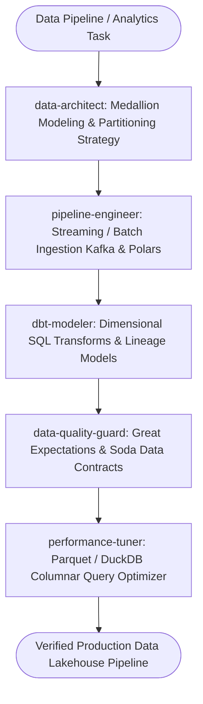

# Data Engineering Master Suite Workflow

**MANDATE**: Build scalable, high-throughput, and observable data ingestion, processing, and analytics pipelines adhering to the Medallion Architecture (Bronze -> Silver -> Gold), schema evolution controls, data contract assertions, and automated performance tuning.

---

## 1. Multi-Agent Delegation Pipeline



| Phase | Assigned Subagent | Primary Gate | Artifact Generated |
|-------|-------------------|--------------|---------------------|
| **1. Data Architecture** | `data-architect` | Medallion schema & dimensional design | `data_architecture.md`, star schema |
| **2. Pipeline Ingestion** | `pipeline-engineer` | Kafka/CDC consumers & Polars transforms | Ingestion worker scripts |
| **3. dbt Modeling** | `dbt-modeler` | Idempotent incremental dbt SQL models | dbt models (`.sql`, `.yml`) |
| **4. Quality Contracts** | `data-quality-guard` | Schema validation, null checks, drift checks | Great Expectations suite |
| **5. Query Optimization** | `performance-tuner` | Parquet partitioning, vector indexing | Query benchmark report |

---

## 2. Step-by-Step Execution Lifecycle

### Step 1: Medallion Architecture & Dimensional Modeling
1. **Bronze Layer (Raw)**: Ingest raw streaming and batch records verbatim in append-only format with ingestion metadata (`_ingested_at`, `_source_file`).
2. **Silver Layer (Cleaned)**: Deduplicate, conform data types, parse JSON structures, and apply schema contracts.
3. **Gold Layer (Aggregated)**: Build Star Schema (Fact and Dimension tables) optimized for BI dashboards and machine learning features.

```sql
-- Gold Layer: Star Schema Dimensional Model (PostgreSQL / DuckDB)
CREATE TABLE IF NOT EXISTS dim_customers (
    customer_key BIGINT PRIMARY KEY,
    customer_id UUID NOT NULL,
    country_code VARCHAR(3) NOT NULL,
    tier VARCHAR(32) NOT NULL,
    valid_from TIMESTAMPTZ NOT NULL,
    valid_to TIMESTAMPTZ,
    is_current BOOLEAN NOT NULL DEFAULT true
);

CREATE TABLE IF NOT EXISTS fact_daily_sales (
    date_key INTEGER NOT NULL,
    customer_key BIGINT NOT NULL REFERENCES dim_customers(customer_key),
    total_orders INTEGER NOT NULL,
    gross_revenue_cents BIGINT NOT NULL,
    discount_cents BIGINT NOT NULL,
    net_revenue_cents BIGINT NOT NULL,
    PRIMARY KEY (date_key, customer_key)
);
```

### Step 2: High-Performance Data Processing (Polars / DuckDB)
1. Use vectorized execution engines (Polars in Python/Rust or DuckDB) instead of heavy JVM clusters for single-node sub-terabyte datasets.
2. Apply lazy execution (`scan_parquet`) to push down predicates and column projections.

```python
# pipeline/process_orders.py
import polars as pl

# ponytail: Vectorized Polars aggregation - single pass lazy projection
def aggregate_hourly_revenue(parquet_path: str) -> pl.DataFrame:
    return (
        pl.scan_parquet(parquet_path)
        .filter(pl.col("status") == "COMPLETED")
        .with_columns(
            pl.col("timestamp").dt.truncate("1h").alias("hour_bucket"),
            (pl.col("gross_amount_cents") - pl.col("discount_cents")).alias("net_amount_cents")
        )
        .group_by(["hour_bucket", "currency"])
        .agg([
            pl.count().alias("order_count"),
            pl.sum("net_amount_cents").alias("total_net_revenue_cents")
        ])
        .collect()
    )
```

### Step 3: dbt Dimensional Transformations
1. Write idempotent incremental models with unique key merges (`incremental_strategy='merge'`).
2. Define source fresh checks (`loaded_at_field`) and column tests (`unique`, `not_null`, `relationships`).

### Step 4: Data Quality Contracts (Great Expectations)
1. Validate incoming datasets against strict schemas before promoting to Silver/Gold tiers.
2. Alert on schema drift (unexpected columns or type alterations).

### Step 5: Streaming Change Data Capture (CDC)
1. Ingest relational database WAL changes with Debezium into Apache Kafka.
2. Consume events with exactly-once idempotency filters.

### Step 6: Parquet Compaction & ZSTD Compression
1. Compact small streaming files into 256MB Parquet chunks on scheduled daily cron.
2. Maintain partition indexing on year/month/day.

```python
# pipeline/compactor.py
import duckdb

def compact_daily_partitions(source_dir: str, target_file: str):
    con = duckdb.connect()
    con.sql(f'''
        COPY (SELECT * FROM read_parquet('{source_dir}/*.parquet'))
        TO '{target_file}' (FORMAT PARQUET, COMPRESSION 'ZSTD', ROW_GROUP_SIZE 100000);
    ''')
```

---

## 3. Subagent Execution Prompts

### Subagent: `data-architect`
```markdown
You are the Lead Data Architect. Design the data warehouse / lakehouse topology:
1. Establish the Medallion tier separation (Bronze, Silver, Gold).
2. Design Star Schema (Facts & Dimensions) with SCD Type 2 tracking for entities.
3. Define partitioning keys (e.g., date partition by year/month) and compression codecs (Snappy/ZSTD).
```

### Subagent: `pipeline-engineer`
```markdown
You are the Data Pipeline Engineer. Implement ingestion and ETL/ELT pipelines:
1. Configure Kafka / CDC consumers with at-least-once delivery guarantees.
2. Author fast, memory-safe data transformations using Polars or DuckDB.
3. Apply Ponytail Minimalism: avoid Spark/Hadoop clusters if DuckDB/Polars processes the dataset in seconds.
```

### Subagent: `dbt-modeler`
```markdown
You are the dbt Analytics Engineer. Build dimensional models:
1. Author staging, intermediate, and marts SQL models adhering to dbt style guides.
2. Configure incremental merge strategies with appropriate unique keys.
3. Write comprehensive schema.yml documentation and column-level tests.
```

### Subagent: `data-quality-guard`
```markdown
You are the Data Quality Specialist. Enforce data contracts:
1. Define Great Expectations / Soda assertion suites (Null checks, foreign key integrity, range validations).
2. Implement automated quarantine for invalid records (Dead Letter Tables).
3. Set up freshness alerts to catch delayed upstream data pipelines.
```

### Subagent: `performance-tuner`
```markdown
You are the Database & Query Performance Tuner:
1. Analyze EXPLAIN plans for slow aggregation queries on Postgres/DuckDB.
2. Optimize Parquet row group sizes (typically 128MB - 256MB) and bloom filters.
3. Benchmark query latency and memory consumption.
```

---

## 4. dbt Schema Testing Blueprint

```yaml
# models/schema.yml
version: 2

models:
  - name: fact_daily_sales
    description: "Daily aggregated revenue and order metrics per customer"
    columns:
      - name: date_key
        tests:
          - not_null
      - name: customer_key
        tests:
          - not_null
          - relationships:
              to: ref('dim_customers')
              field: customer_key
      - name: net_revenue_cents
        tests:
          - not_null
```

---

## 5. Definition of Done (DoD) Checklist

- [ ] Medallion Architecture implemented with clear separation between raw and conformed tiers.
- [ ] Star Schema fact and dimension tables created with foreign key integrity.
- [ ] Vectorized processing (Polars/DuckDB) utilized for sub-second aggregations.
- [ ] dbt models documented and covered by automated schema tests (`unique`, `not_null`).
- [ ] Great Expectations data contract validation active on all ingestion pipelines.
- [ ] Parquet files partitioned and compressed using ZSTD/Snappy.
- [ ] `python scripts/safety_guard.py --scan-file .` clean with 0 leaked connection strings.
