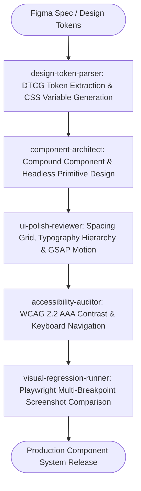

# Design to Code Master Suite Workflow

**MANDATE**: Transform visual design specifications and Figma tokens into pixel-perfect, accessible (WCAG 2.2 AAA), fluidly responsive, and high-performance React components backed by autonomous visual regression testing.

---

## 1. Multi-Agent Delegation Pipeline



| Phase | Assigned Subagent | Primary Gate | Artifact Generated |
|-------|-------------------|--------------|---------------------|
| **1. Token Extraction** | `design-token-parser` | DTCG JSON tokens -> Tailwind v4 CSS variables | `tokens.css`, `theme.ts` |
| **2. Component Architecture** | `component-architect` | Headless, accessible compound components | Component files (`.tsx`) |
| **3. Motion & Polish** | `ui-polish-reviewer` | 60/120fps GSAP transitions & spacing audit | Micro-interactions & animations |
| **4. Accessibility Audit** | `accessibility-auditor` | Contrast >= 7:1 (AAA), screen reader ARIA | Accessibility audit report |
| **5. Visual Regression** | `visual-regression-runner` | 0 pixel diff across 320, 768, 1024, 1440px | Playwright visual diffs |

---

## 2. Step-by-Step Execution Lifecycle

### Step 1: Design Tokens & Variable Extraction (DTCG Standard)
1. **Token Hierarchy**: Map Global Tokens (Raw color/scale) -> Semantic Tokens (Surface, Text, Border) -> Component Tokens (Button Primary, Card Elevated).
2. **Color Space**: Use modern `oklch` for perceptual uniformity and vibrant wide-gamut displays.
3. **Fluid Typography**: Implement fluid sizing via CSS `clamp()` scales (e.g., `clamp(1rem, 0.95rem + 0.5vw, 1.25rem)`).

```css
/* tokens.css: Design Token Standard (Tailwind v4) */
@theme {
  --color-surface-base: oklch(0.99 0.005 250);
  --color-surface-elevated: oklch(0.95 0.01 250);
  --color-text-primary: oklch(0.15 0.02 260);
  --color-text-secondary: oklch(0.45 0.02 260);
  --color-brand-accent: oklch(0.62 0.22 265);

  --font-heading: 'Plus Jakarta Sans', system-ui, sans-serif;
  --font-body: 'Inter Variable', system-ui, sans-serif;

  --space-unit: 4px;
  --radius-card: 16px;
  --radius-button: 10px;
}
```

### Step 2: Headless Compound Component Architecture
1. **Separation of Concerns**: Separate interaction state / keyboard navigation from visual presentation.
2. **Compound Pattern**: Provide cohesive sub-components (`<Modal.Root>`, `<Modal.Trigger>`, `<Modal.Content>`).
3. **Radix / Ark UI Primitives**: Use battle-tested accessible primitives to avoid reinventing focus management.

```tsx
// components/ui/Card.tsx
import * as React from 'react';

interface CardProps extends React.HTMLAttributes<HTMLDivElement> {
  elevated?: boolean;
}

// ponytail: Minimalist Compound Card - semantic HTML with fluid styling
export function Card({ elevated, className, children, ...props }: CardProps) {
  return (
    <div
      className={`rounded-2xl border p-6 transition-all duration-200 ${
        elevated ? 'bg-surface-elevated shadow-lg border-transparent' : 'bg-surface-base border-gray-200'
      } ${className || ''}`}
      {...props}
    >
      {children}
    </div>
  );
}

Card.Title = function CardTitle({ children }: { children: React.ReactNode }) {
  return <h3 className="text-xl font-bold text-text-primary font-heading">{children}</h3>;
};

Card.Body = function CardBody({ children }: { children: React.ReactNode }) {
  return <div className="mt-3 text-sm leading-relaxed text-text-secondary font-body">{children}</div>;
};
```

### Step 3: GSAP Micro-Interactions & 60fps Motion
1. **Compositor Exclusivity**: Limit animations to `transform` and `opacity`.
2. **Reduced Motion**: Respect `prefers-reduced-motion` media queries by bypassing motion timelines when requested.

```typescript
// hooks/useGSAPEntrance.ts
import { useEffect, useRef } from 'react';
import { gsap } from 'gsap';

export function useGSAPEntrance() {
  const elementRef = useRef<HTMLDivElement>(null);

  useEffect(() => {
    const prefersReduced = window.matchMedia('(prefers-reduced-motion: reduce)').matches;
    if (prefersReduced || !elementRef.current) return;

    const ctx = gsap.context(() => {
      gsap.from(elementRef.current, {
        opacity: 0,
        y: 20,
        duration: 0.4,
        ease: 'power2.out',
      });
    }, elementRef);

    return () => ctx.revert();
  }, []);

  return elementRef;
}
```

### Step 4: Visual Regression Verification
1. Capture screenshots at 375px (Mobile), 768px (Tablet), 1280px (Desktop), and 1920px (Wide).
2. Fail CI build if visual difference delta exceeds 0.1%.

---

## 3. Subagent Execution Prompts

### Subagent: `design-token-parser`
```markdown
You are the Design Token Specialist. Convert Figma token JSON into CSS variables:
1. Generate semantic tokens for light and dark modes in oklch color space.
2. Implement fluid typography clamp() formulas across standard viewport widths.
3. Configure Tailwind CSS v4 @theme directives.
```

### Subagent: `component-architect`
```markdown
You are the UI Component Architect. Build headless and compound components:
1. Implement Radix/Ark UI primitives for focus management and keyboard navigation.
2. Structure components using compound patterns (Root, Header, Content, Footer).
3. Apply Ponytail Minimalism: zero unrequested props or premature configurability.
```

### Subagent: `ui-polish-reviewer`
```markdown
You are the UI Polish & Motion Specialist. Audit visual excellence:
1. Check spacing rhythm strictly against the 4px/8px grid scale.
2. Audit GSAP animations for compositor efficiency and memory cleanup in React hooks.
3. Ensure dark/light theme switching occurs seamlessly with zero flash of unstyled content (FOUC).
```

### Subagent: `accessibility-auditor`
```markdown
You are the Lead Accessibility Auditor. Verify WCAG 2.2 standards:
1. Assert color contrast >= 7:1 for normal text and >= 4.5:1 for large elements.
2. Audit keyboard navigation (Tab, Shift+Tab, Escape, Enter, Space) and focus traps.
3. Verify ARIA attributes (aria-expanded, aria-controls, aria-labelledby).
```

### Subagent: `visual-regression-runner`
```markdown
You are the Visual QA Engineer. Run multi-breakpoint Playwright screenshot tests:
1. Capture visual baselines for all components across breakpoints (375px, 768px, 1280px).
2. Test active, hover, focused, and error states.
3. Report any pixel drift > 0.1% in visual_diff_report.md.
```

---

## 4. Playwright Visual Regression Test Spec

```typescript
// tests/visual/components.spec.ts
import { test, expect } from '@playwright/test';

const BREAKPOINTS = [
  { name: 'mobile', width: 375, height: 667 },
  { name: 'tablet', width: 768, height: 1024 },
  { name: 'desktop', width: 1280, height: 800 },
];

for (const bp of BREAKPOINTS) {
  test(`visual regression for Card component on ${bp.name}`, async ({ page }) => {
    await page.setViewportSize({ width: bp.width, height: bp.height });
    await page.goto('/storybook/card');
    await expect(page.locator('#component-root')).toHaveScreenshot(`card-${bp.name}.png`, {
      maxDiffPixelRatio: 0.001,
    });
  });
}
```

---

## 5. Definition of Done (DoD) Checklist

- [ ] Figma tokens exported and compiled to Tailwind v4 `@theme` CSS variables.
- [ ] Compound component patterns implemented with clean TypeScript types.
- [ ] WCAG 2.2 AAA accessibility passed (Contrast >= 7:1, keyboard trap free).
- [ ] `prefers-reduced-motion` respected in all CSS and GSAP animations.
- [ ] Playwright visual regression tests pass with 0 unexpected pixel diffs.
- [ ] Zero layout shift (CLS < 0.05) measured across responsive viewports.
