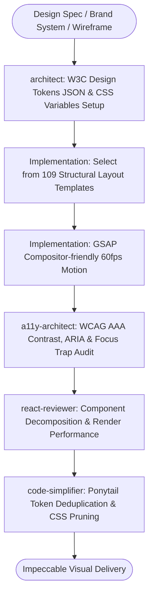

# Design to Code Master Suite Workflow

**MANDATE**: Transform visual concepts and brand identities into pixel-perfect, accessible, and performant code without generic template patterns.

---

## 1. Multi-Agent Delegation Pipeline



| Phase | Assigned Subagent | Primary Gate | Artifact Generated |
|-------|-------------------|--------------|---------------------|
| **1. Token Architecture** | `architect` | W3C Token JSON extraction, CSS Custom Properties | `tokens.css`, theme variables |
| **2. Accessibility Gate** | `a11y-architect` | WCAG 2.2 AAA contrast, screen reader semantics | A11y compliance report |
| **3. Component Review** | `react-reviewer` | Layout shifts, zero DOM re-render churn | React component audit |
| **4. Code Pruning** | `code-simplifier` | Ponytail CSS minimalism, dead class purging | Optimized stylesheet & JSX |

---

## 2. Step-by-Step Execution Lifecycle

### Step 1: Design System & Brand Identity Selection
Select from the 150+ supported Design Systems:
- **Apple**: Clean typography (SF Pro), subtle translucent glassmorphism (`backdrop-blur-md`), dark luxury contrast.
- **Stripe**: Multi-color mesh gradients, precise 4px grid spacing, floating surface cards with elevated shadows.
- **Linear**: Dark mode minimalism, high-contrast monochrome with electric accents, micro-borders (`border-white/10`).
- **Neo-Brutalism**: Thick black borders (`border-2 border-black`), sharp offset drop shadows (`shadow-[4px_4px_0px_0px_#000]`), bold vibrant palettes.
- **Bento Grid**: Asymmetrical editorial card layouts, varied aspect ratios, micro-interactions on hover.

### Step 2: W3C Design Tokens & Fluid Layout Scales
1. **W3C Tokens JSON**: Define colors in OKLCH color space for perceptually uniform lightness across light/dark modes.
2. **Fluid Typography & Spacing**: Use CSS `clamp()` functions to eliminate layout breakpoints where continuous scaling is cleaner.

```css
:root {
  /* OKLCH Theme Tokens */
  --color-surface-base: oklch(98% 0.01 250);
  --color-surface-card: oklch(100% 0 0);
  --color-text-primary: oklch(18% 0.02 260);
  --color-brand-accent: oklch(65% 0.22 260);

  /* Fluid Typography Scales */
  --text-body: clamp(1rem, 0.95rem + 0.25vw, 1.125rem);
  --text-heading: clamp(2rem, 1.5rem + 2.5vw, 3.75rem);
  --text-display: clamp(3rem, 2rem + 5vw, 6rem);

  /* Fluid Spacing Scales */
  --space-unit: 4px;
  --space-section: clamp(3rem, 2rem + 4vw, 8rem);
  --space-card: clamp(1rem, 0.8rem + 1vw, 2rem);
}
```

### Step 3: Structural Layout Implementation (109 Templates)
- Construct semantic DOM structures (`header`, `main`, `section`, `article`, `footer`).
- Ban unstyled wrapper `div` soup.
- Apply bento layout patterns or editorial rhythm using CSS Grid:

```tsx
// components/BentoGrid.tsx
export function BentoGrid({ children }: { children: React.ReactNode }) {
  // ponytail: Semantic CSS Grid layout - responsive 1-to-3 column bento
  return (
    <section className="grid grid-cols-1 md:grid-cols-3 gap-6 auto-rows-[280px]">
      {children}
    </section>
  );
}
```

### Step 4: 60fps Compositor-Friendly Motion (GSAP)
1. Animate exclusively on compositor properties: `transform` (`x`, `y`, `scale`, `rotation`) and `opacity`.
2. Avoid animating layout properties (`width`, `height`, `top`, `margin`, `padding`).
3. Honor `prefers-reduced-motion` media queries.

```typescript
// hooks/useSmoothReveal.ts
import { useLayoutEffect, useRef } from 'react';
import gsap from 'gsap';

export function useSmoothReveal() {
  const containerRef = useRef<HTMLDivElement>(null);

  useLayoutEffect(() => {
    const prefersReduced = window.matchMedia('(prefers-reduced-motion: reduce)').matches;
    if (prefersReduced || !containerRef.current) return;

    const ctx = gsap.context(() => {
      gsap.from(containerRef.current!.children, {
        y: 24,
        opacity: 0,
        duration: 0.8,
        stagger: 0.1,
        ease: 'power3.out',
      });
    }, containerRef);

    return () => ctx.revert();
  }, []);

  return containerRef;
}
```

### Step 5: Accessibility & WCAG AAA Verification
1. **Contrast Ratio**: Normal text $\ge 7:1$ (AAA) or $\ge 4.5:1$ (AA); UI components $\ge 3:1$.
2. **Keyboard Navigation**: Focus rings visible on all interactive elements (`focus-visible:outline-2 focus-visible:outline-brand-accent`).
3. **Screen Readers**: `aria-label`, `aria-expanded`, and descriptive semantic landmarks.

---

## 3. Definition of Done (DoD) Checklist

- [ ] Design Tokens defined in OKLCH color space and standard CSS custom properties.
- [ ] Typography and spacing use fluid `clamp()` functions with zero layout jumps.
- [ ] Semantic HTML used exclusively (zero excessive wrapper `div`s).
- [ ] GSAP animations animate compositor properties (`transform`, `opacity`) and clean up in `useEffect`.
- [ ] `prefers-reduced-motion` respected across all animated elements.
- [ ] WCAG contrast ratios verified ($\ge 4.5:1$ minimum, $\ge 7:1$ for AAA).
- [ ] Subagent reviews passed (`a11y-architect`, `react-reviewer`, `code-simplifier`).
