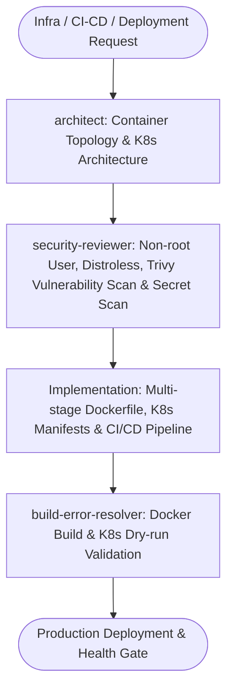

# DevOps Cloud Master Suite Workflow

**MANDATE**: Automate infrastructure, containerization, and deployment pipelines with zero-trust security postures, minimal image footprints, and autonomous diagnostic loops.

---

## 1. Multi-Agent Delegation Pipeline



| Phase | Assigned Subagent | Primary Gate | Artifact Generated |
|-------|-------------------|--------------|---------------------|
| **1. Topology Planning** | `architect` | Resource quotas, readiness probes, service mesh | K8s architecture & Helm values |
| **2. Security Posture** | `security-reviewer` | Non-root context, Distroless base, Trivy scan | Container security audit report |
| **3. Build & Diagnostics** | `build-error-resolver` | Multi-stage caching, compiler build fixes | Verified Dockerfile & CI manifests |

---

## 2. Step-by-Step Execution Lifecycle

### Step 1: Multi-Stage Non-Root Distroless Containerization
1. **Multi-Stage Build**: Compile dependencies in a dedicated build stage; copy only the compiled binary / runtime bundle to production.
2. **Non-Root Execution**: Explicitly define UID/GID ($10001:10001$) with root filesystem read-only permissions.
3. **Distroless Base**: Use `gcr.io/distroless/static-debian12` or `node:22-alpine` without shell access in production.

```dockerfile
# syntax=docker/dockerfile:1.4
# Stage 1: Build & Package
FROM node:22-alpine AS builder
WORKDIR /app
COPY package.json pnpm-lock.yaml ./
RUN corepack enable && pnpm install --frozen-lockfile
COPY . .
RUN pnpm build && pnpm prune --prod

# Stage 2: Distroless Production Runner
FROM gcr.io/distroless/nodejs22-debian12:nonroot
WORKDIR /app
COPY --from=builder --chown=nonroot:nonroot /app/package.json ./
COPY --from=builder --chown=nonroot:nonroot /app/node_modules ./node_modules
COPY --from=builder --chown=nonroot:nonroot /app/dist ./dist

USER nonroot:nonroot
EXPOSE 3000
ENV NODE_ENV=production
CMD ["dist/index.js"]
```

### Step 2: Kubernetes Manifests & Pod Disruption Budgets
1. **Liveness & Readiness Probes**: Define HTTP `/healthz` and `/readyz` endpoints with failure thresholds.
2. **Resource Requests & Limits**: Prevent noisy neighbor issues by enforcing explicit CPU and Memory bounds.
3. **Security Context**:
   ```yaml
   securityContext:
     runAsNonRoot: true
     runAsUser: 10001
     readOnlyRootFilesystem: true
     allowPrivilegeEscalation: false
     capabilities:
       drop: ["ALL"]
   ```

### Step 3: 3-Stage GitHub Actions CI/CD Pipeline
Every pipeline executes in 3 sequential, gated jobs:
1. **Stage 1 (Lint & Secret Scan)**: ESLint, TypeScript check, and `python scripts/safety_guard.py --scan-file .`.
2. **Stage 2 (Unit & Integration Tests)**: Run test suites with PostgreSQL / Redis service containers.
3. **Stage 3 (Build & Push)**: Multi-arch Docker build using GitHub Actions cache export (`type=gha`).

### Step 4: Zero-Trust & WireGuard Networking
- Enforce mTLS across internal pod-to-pod communications.
- Restrict remote ingress strictly through WireGuard / Cloudflare Zero Trust tunnels.

---

## 3. Definition of Done (DoD) Checklist

- [ ] Multi-stage Dockerfile builds successfully with non-root security context.
- [ ] Container images use distroless or minimal alpine base with 0 critical CVEs.
- [ ] Kubernetes manifests include explicit resource requests/limits and health probes.
- [ ] GitHub Actions pipeline configured for 3 stages (Lint/Scan → Test → Build/Push).
- [ ] Secret scan clean (`python scripts/safety_guard.py --scan-file .`).
- [ ] Subagent sign-offs obtained (`architect`, `security-reviewer`, `build-error-resolver`).
