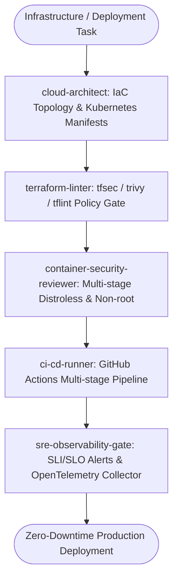

# DevOps Cloud Master Suite Workflow

**MANDATE**: Automate, secure, and operate enterprise cloud infrastructure using Declarative Infrastructure as Code (Terraform/OpenTofu), minimal distroless containers, Kubernetes resilient topologies, automated canary CI/CD pipelines, and comprehensive SRE telemetry.

---

## 1. Multi-Agent Delegation Pipeline



| Phase | Assigned Subagent | Primary Gate | Artifact Generated |
|-------|-------------------|--------------|---------------------|
| **1. IaC Architecture** | `cloud-architect` | Modular Terraform / K8s manifests | `.tf` files, `k8s/*.yaml` |
| **2. Static Security Scan** | `terraform-linter` | 0 high/critical CVEs on `trivy` / `tfsec` | IaC Security Report |
| **3. Container Hardening** | `container-security-reviewer` | Non-root user, minimal base image | Hardened `Dockerfile` |
| **4. Pipeline Execution** | `ci-cd-runner` | Lint -> Security -> Test -> Build -> Deploy | `.github/workflows/deploy.yml` |
| **5. SRE Observability Gate** | `sre-observability-gate` | Prometheus rules, HPA, PDB, Health checks | Alerting rules, SLO dashboard |

---

## 2. Step-by-Step Execution Lifecycle

### Step 1: Declarative Infrastructure as Code (Terraform / OpenTofu)
1. **Remote State Locking**: Configure S3 / GCS backend with DynamoDB / native state locking.
2. **Modular Architecture**: Separate state by environment (`environments/prod/`, `environments/stage/`).
3. **Ponytail Rule**: Avoid multi-layered wrapper modules; use direct provider resources with explicit tags.

### Step 2: Containerization & Distroless Hardening
1. **Multi-Stage Builds**: Compile binaries in a heavy build stage; copy artifacts to a minimal `gcr.io/distroless` or `alpine` runtime image.
2. **Non-Root Execution**: Explicitly define and switch to a non-privileged user (`USER 65532:65532` / `USER node`).
3. **Immutable Layers**: Pin image base digests (`node:22-alpine@sha256:...`).

```dockerfile
# Dockerfile: Multi-Stage Distroless Production Build
# Step 1: Build stage
FROM node:22-alpine AS builder
WORKDIR /app
COPY package.json pnpm-lock.yaml ./
RUN npm install -g pnpm && pnpm install --frozen-lockfile
COPY . .
RUN pnpm build

# Step 2: Production Distroless Runtime
FROM gcr.io/distroless/nodejs22-debian12:nonroot
WORKDIR /app
COPY --from=builder /app/package.json ./
COPY --from=builder /app/node_modules ./node_modules
COPY --from=builder /app/dist ./dist
ENV NODE_ENV=production
USER nonroot:nonroot
EXPOSE 3000
CMD ["dist/main.js"]
```

### Step 3: Resilient Kubernetes Topologies
1. **High Availability**:
   - Set `HorizontalPodAutoscaler` (HPA) targeting 70% CPU / Memory utilization.
   - Configure `PodDisruptionBudget` (PDB) with `minAvailable: 50%`.
2. **Probes & Graceful Draining**:
   - `readinessProbe`: Validates dependency connectivity before receiving ingress traffic.
   - `livenessProbe`: Restarts deadlocked processes.
   - `terminationGracePeriodSeconds`: 30s for in-flight request completion.

### Step 4: GitHub Actions Multi-Stage CI/CD Pipeline
1. **Stage 1 (Lint & Secret Scan)**: `python scripts/safety_guard.py` + ESLint + Terraform fmt.
2. **Stage 2 (Automated Test Suite)**: Unit & Integration tests executed in ephemeral containers.
3. **Stage 3 (Container Security)**: Trivy image scan.
4. **Stage 4 (Canary / Blue-Green Release)**: Deploy 10% canary, monitor error rates for 5m, promote to 100%.

---

## 3. Subagent Execution Prompts

### Subagent: `cloud-architect`
```markdown
You are the Cloud Infrastructure Architect. Design the cloud topology:
1. Write modular Terraform/OpenTofu configurations (VPC, EKS/GKE, RDS, Redis, IAM).
2. Author Kubernetes manifests including Deployment, Service, Ingress, HPA, PDB, and NetworkPolicy.
3. Apply Ponytail Minimalism: do not introduce unnecessary service mesh complexity if native Ingress handles the workload.
```

### Subagent: `terraform-linter`
```markdown
You are the IaC Security Auditor. Review infrastructure code:
1. Run static checks with tfsec/trivy. Ensure zero unencrypted S3 buckets or open 0.0.0.0/0 security groups.
2. Verify all resources have cost-allocation tags (Environment, Project, Owner).
3. Validate remote state locking configurations.
```

### Subagent: `container-security-reviewer`
```markdown
You are the Container Hardening Specialist. Audit Dockerfiles:
1. Verify multi-stage build patterns and non-root execution.
2. Check for pinned base image hashes and zero secret leaks in layer caches.
3. Audit .dockerignore to prevent local .env or .git files from entering build context.
```

### Subagent: `ci-cd-runner`
```markdown
You are the CI/CD Pipeline Engineer. Build the deployment pipeline:
1. Author GitHub Actions workflows with strict branch protection gates.
2. Configure OIDC authentication to AWS/GCP (Zero permanent static credentials).
3. Implement automated rollback triggers if post-deploy health checks fail.
```

### Subagent: `sre-observability-gate`
```markdown
You are the Site Reliability Engineer. Configure APM and alerting:
1. Define Prometheus metrics scraping and Grafana SLO dashboards (99.9% uptime, p95 latency < 50ms).
2. Configure alert thresholds for CrashLoopBackOff, high memory usage, and error rate spikes (>1%).
3. Verify OpenTelemetry collector daemonsets and log aggregation.
```

---

## 4. Kubernetes Deployment & HPA Manifest

```yaml
apiVersion: apps/v1
kind: Deployment
metadata:
  name: api-service
  namespace: production
  labels:
    app.kubernetes.io/name: api-service
spec:
  replicas: 3
  strategy:
    type: RollingUpdate
    rollingUpdate:
      maxSurge: 25%
      maxUnavailable: 0
  selector:
    matchLabels:
      app: api-service
  template:
    metadata:
      labels:
        app: api-service
    spec:
      securityContext:
        runAsNonRoot: true
        runAsUser: 65532
        fsGroup: 65532
      containers:
        - name: server
          image: ghcr.io/org/api-service:v1.2.0
          imagePullPolicy: IfNotPresent
          resources:
            requests:
              cpu: 250m
              memory: 256Mi
            limits:
              cpu: 1000m
              memory: 1024Mi
          ports:
            - containerPort: 3000
          readinessProbe:
            httpGet:
              path: /health/ready
              port: 3000
            initialDelaySeconds: 5
            periodSeconds: 10
          livenessProbe:
            httpGet:
              path: /health/live
              port: 3000
            initialDelaySeconds: 15
            periodSeconds: 20
---
apiVersion: autoscaling/v2
kind: HorizontalPodAutoscaler
metadata:
  name: api-service-hpa
  namespace: production
spec:
  scaleTargetRef:
    apiVersion: apps/v1
    kind: Deployment
    name: api-service
  minReplicas: 3
  maxReplicas: 20
  metrics:
    - type: Resource
      resource:
        name: cpu
        target:
          type: Utilization
          averageUtilization: 70
```

---

## 5. Prometheus SRE Alerting Rules Blueprint

```yaml
# prometheus/alerts.yaml
groups:
  - name: api_service_alerts
    rules:
      - alert: HighErrorRate
        expr: sum(rate(http_requests_total{status=~"5.."}[5m])) / sum(rate(http_requests_total[5m])) * 100 > 1
        for: 2m
        labels:
          severity: critical
        annotations:
          summary: "API Service HTTP 5xx error rate exceeds 1%"
          description: "High error rate observed: {{ $value }}% of requests failing."

      - alert: HighP95Latency
        expr: histogram_quantile(0.95, sum(rate(http_request_duration_seconds_bucket[5m])) by (le)) > 0.05
        for: 5m
        labels:
          severity: warning
        annotations:
          summary: "API Service p95 latency is higher than 50ms"
```

---

## 6. Definition of Done (DoD) Checklist

- [ ] Terraform state locked remotely and validated with `terraform fmt` and `trivy`.
- [ ] Container image builds from distroless / non-root base and contains 0 critical CVEs.
- [ ] Kubernetes Deployments configured with HPA, PDB, and proper Liveness/Readiness probes.
- [ ] NetworkPolicies isolate database tiers from public ingress pods.
- [ ] GitHub Actions CI/CD runs OIDC auth without hardcoded cloud secrets.
- [ ] `python scripts/safety_guard.py --scan-file .` executed clean.
- [ ] Prometheus alerts and Grafana dashboards actively reporting metrics.
