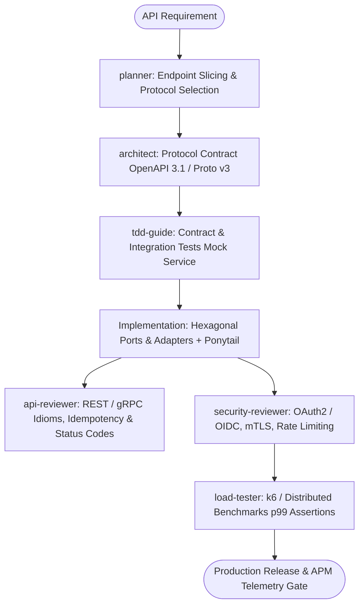

# Enterprise API Master Suite Workflow

**MANDATE**: Engineer ultra-reliable, high-throughput distributed APIs adhering to Hexagonal / Clean Architecture, contract-first design, distributed resilience, and comprehensive observability.

---

## 1. Multi-Agent Delegation Pipeline



| Phase | Assigned Subagent | Primary Gate | Artifact Generated |
|-------|-------------------|--------------|---------------------|
| **1. Protocol & Contract Planning** | `planner` | Protocol selection (REST vs gRPC vs WSS) | `api_plan.md`, service contracts |
| **2. Contract Schema Architecture** | `architect` | OpenAPI 3.1 / Protobuf v3 strict definition | `openapi.yaml`, `service.proto` |
| **3. Contract Test Harness** | `tdd-guide` | Red contract tests & mock servers | Pact / Prism / Vitest test suite |
| **4. API Idiom & Code Review** | `api-reviewer` | Hexagonal boundaries, idempotency, errors | API Code Review report |
| **5. Security & Auth Verification** | `security-reviewer` | JWT/mTLS claims, token bucket, CORS | Security audit clearance |
| **6. Performance & Load Gate** | `load-tester` | p95 < 25ms, p99 < 80ms under 5k RPS | k6 benchmark results |

---

## 2. Step-by-Step Execution Lifecycle

### Step 1: Contract-First Design
1. **Contract Definition**: Author OpenAPI 3.1 or Protobuf v3 specification before writing server implementations.
2. **Schema Linting**: Validate contract against Spectral rulesets (`spectral lint openapi.yaml`).
3. **Code Generation**: Generate type-safe server stubs and client SDKs (`orval` or `buf generate`).

### Step 2: Hexagonal Backend Architecture
1. **Core Domain (Ports)**: Define domain models and business interfaces strictly decoupled from databases and transport protocols.
2. **Infrastructure Adapters**: Implement inbound HTTP/gRPC controllers and outbound database repositories.
3. **Idempotency Enforcement**:
   - Mutating routes (`POST /payments`, `PUT /orders`) must accept an `Idempotency-Key` header.
   - Acquire Redis distributed lock (`SET lock:<key> <id> NX EX 30`).

```typescript
// ponytail: Redis Idempotency Gate - single atomic lock, upgrade to 2PC when multi-region
export async function withIdempotency<T>(
  redis: any,
  key: string,
  handler: () => Promise<T>
): Promise<{ status: 'processed' | 'cached'; data: T }> {
  const cacheKey = `idempotency:${key}`;
  const existing = await redis.get(cacheKey);
  if (existing) return { status: 'cached', data: JSON.parse(existing) };

  const result = await handler();
  await redis.setex(cacheKey, 86400, JSON.stringify(result));
  return { status: 'processed', data: result };
}
```

### Step 3: Distributed Resilience & Fault Tolerance
1. **Circuit Breakers**: Wrap external downstream dependencies in circuit breakers (Fail-Fast after 5 consecutive 5xx errors; 10s cooldown).
2. **Rate Limiting**: Apply distributed token bucket via Redis sliding window per API key / IP address.
3. **Graceful Shutdown**:
   - Handle `SIGTERM` / `SIGINT`.
   - Stop accepting new traffic, finish in-flight requests with a 15-second timeout, then close DB connections.

### Step 4: Observability & Telemetry
1. **Distributed Tracing**: Propagate W3C Trace Context (`traceparent`) across microservice boundaries via OpenTelemetry.
2. **Standard Metrics**: Expose Prometheus `/metrics` endpoints (`http_requests_total`, `http_request_duration_seconds_bucket`).
3. **Structured Logging**: Emit structured JSON logs containing `timestamp`, `level`, `trace_id`, `span_id`, `route`, `status_code`, `duration_ms`.

---

## 3. Subagent Execution Prompts

### Subagent: `planner`
```markdown
You are the Enterprise API Planner. Analyze requirements and establish API boundaries:
1. Select appropriate protocols: REST for public APIs, gRPC for internal mesh, WebSockets for realtime.
2. Define vertical slices for endpoints with clear request/response DTOs.
3. Enforce the Ponytail Minimalist Directive (no redundant middleware, stdlib/native features first).
```

### Subagent: `architect`
```markdown
You are the Lead API Architect. Create contract-first interface specifications:
1. Generate OpenAPI 3.1 yaml or Protobuf v3 definitions.
2. Enforce RFC 7807 (Problem Details for HTTP APIs) structured error responses.
3. Define database isolation levels and idempotency storage schemas.
```

### Subagent: `tdd-guide`
```markdown
You are the API TDD Guide. Build the integration test suite:
1. Write endpoint tests asserting HTTP status codes (200, 201, 400, 401, 403, 409, 422, 429, 500).
2. Test concurrency race conditions against the idempotency lock.
3. Test circuit breaker tripping on simulated downstream 503 timeouts.
```

### Subagent: `api-reviewer`
```markdown
You are the Enterprise API Reviewer. Audit implementation against standards:
1. Verify strict decoupling between domain entities and transport DTOs.
2. Verify proper HTTP verb usage (GET safe/idempotent, POST non-idempotent, PUT idempotent, PATCH atomic).
3. Confirm OpenTelemetry traceparent context propagation across HTTP/gRPC calls.
```

### Subagent: `security-reviewer`
```markdown
You are the API Security Specialist. Perform thorough security checks:
1. Verify JWT signature validation, issuer/audience validation, and expiration claims.
2. Check for Broken Object Level Authorization (BOLA/IDOR) on entity endpoints.
3. Verify rate-limiting headers (X-RateLimit-Limit, X-RateLimit-Remaining, Retry-After).
```

---

## 4. OpenAPI 3.1 & Protobuf Schema Blueprint

```yaml
openapi: 3.1.0
info:
  title: Enterprise Order Management API
  version: 1.0.0
  description: High-throughput, idempotent order processing service.
paths:
  /v1/orders:
    post:
      summary: Create idempotent order
      parameters:
        - name: Idempotency-Key
          in: header
          required: true
          schema:
            type: string
            format: uuid
      requestBody:
        required: true
        content:
          application/json:
            schema:
              $ref: '#/components/schemas/CreateOrderRequest'
      responses:
        '201':
          description: Order created successfully
          content:
            application/json:
              schema:
                $ref: '#/components/schemas/OrderResponse'
        '409':
          description: Concurrent request in progress
        '429':
          description: Rate limit exceeded
components:
  schemas:
    CreateOrderRequest:
      type: object
      required: [customerId, items, currency]
      properties:
        customerId: { type: string, format: uuid }
        currency: { type: string, enum: [USD, EUR, GBP, JPY] }
        items:
          type: array
          items:
            type: object
            required: [sku, quantity, unitPriceCents]
            properties:
              sku: { type: string }
              quantity: { type: integer, minimum: 1 }
              unitPriceCents: { type: integer, minimum: 0 }
```

---

## 5. Definition of Done (DoD) Checklist

- [ ] OpenAPI 3.1 or Protobuf v3 contract verified via linter (`spectral` / `buf lint`).
- [ ] Hexagonal Architecture boundaries strictly maintained (Zero DB imports in Domain layer).
- [ ] Idempotency key middleware applied to all financial and mutating endpoints.
- [ ] Distributed rate limiting configured with Redis sliding window.
- [ ] Circuit breaker implemented for all external downstream service dependencies.
- [ ] OpenTelemetry distributed tracing active with traceparent headers passed.
- [ ] k6 load tests pass latency targets (p95 < 25ms, 0% error rate under peak load).
- [ ] `python scripts/safety_guard.py --scan-file .` executed with zero detected secrets.
