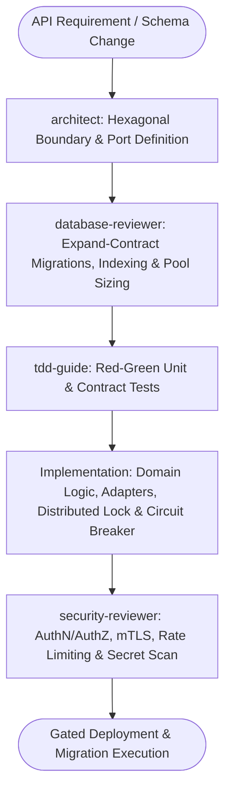

# Enterprise API Master Suite Workflow

**MANDATE**: Architect and deploy robust, zero-downtime, and resilient enterprise APIs through Clean/Hexagonal separation of concerns, distributed concurrency control, and disciplined subagent verification.

---

## 1. Multi-Agent Delegation Pipeline



| Phase | Assigned Subagent | Primary Gate | Artifact Generated |
|-------|-------------------|--------------|---------------------|
| **1. Architecture & Contracts** | `architect` | Hexagonal port isolation, protobuf/OpenAPI specs | Domain models, Port interfaces |
| **2. Data & Migrations** | `database-reviewer` | Expand-Contract zero-downtime migration review | SQL migrations, rollback scripts |
| **3. Contract Testing** | `tdd-guide` | In-memory mock adapters, integration test suites | TDD test fixtures |
| **4. Security & Guardrails** | `security-reviewer` | Scopes, mTLS, Distributed Lock ordering, Secret scan | Security audit & lock order matrix |

---

## 2. Step-by-Step Execution Lifecycle

### Step 1: Hexagonal Domain & Port Definition
1. **Core Domain Isolation**: Pure business logic with zero framework/database dependencies.
2. **Ports & Adapters**: Define primary ports (HTTP/gRPC/GraphQL handlers) and secondary ports (Repositories, Message Queues).
3. **Ponytail Rule**: Avoid multiple implementations when only one database or transport is active. Keep interfaces concrete until polymorphism is required.

```typescript
// ponytail: Domain Entity - pure dataclass with zero ORM annotations
export interface Order {
  id: string;
  customerId: string;
  totalCents: bigint; // Absolute precision: integer cents, no float
  status: 'PENDING' | 'CONFIRMED' | 'FAILED';
  createdAt: Date;
}

export interface OrderRepositoryPort {
  findById(id: string): Promise<Order | null>;
  create(order: Order): Promise<void>;
  updateStatus(id: string, status: Order['status']): Promise<void>;
}
```

### Step 2: Zero-Downtime Database Migrations (Expand-Contract)
1. **Phase 1 (Expand)**: Add new nullable columns or tables. Deploy without breaking existing consumers.
2. **Phase 2 (Dual Write)**: Write to both old and new structures while backfilling historical records.
3. **Phase 3 (Contract)**: Switch reads exclusively to the new column; drop deprecated columns safely.
4. **Connection Pooling**: Enforce bounded max connection counts and query timeout parameters.

### Step 3: Concurrency Control & Distributed Locking (2PL)
1. **Two-Phase Locking**: Acquire locks in deterministic priority order (`DB Migration > Config > Entity > Session`).
2. **Backoff & Jitter**: Maximum 30s timeout with random retry backoff to eliminate circular wait deadlocks.

```typescript
// lib/distributed-lock.ts
import { Redis } from 'ioredis';

// ponytail: Redis Lock - single SET NX PX command, upgrade to Redlock only if multi-cluster
export async function withDistributedLock<T>(
  redis: Redis,
  resourceKey: string,
  ttlMs: number,
  workFn: () => Promise<T>
): Promise<T> {
  const lockToken = Math.random().toString(36).substring(2);
  const acquired = await redis.set(`lock:${resourceKey}`, lockToken, 'PX', ttlMs, 'NX');

  if (!acquired) {
    throw new Error(`[LOCK_FAILED] Resource is locked: ${resourceKey}`);
  }

  try {
    return await workFn();
  } finally {
    const luaRelease = `
      if redis.call("get", KEYS[1]) == ARGV[1] then
        return redis.call("del", KEYS[1])
      else
        return 0
      end
    `;
    await redis.eval(luaRelease, 1, `lock:${resourceKey}`, lockToken);
  }
}
```

### Step 4: 3-Strike Circuit Breaker Pattern
1. **Closed**: Normal operations; failures increment counter.
2. **Open**: 3 consecutive failures trips the breaker; immediate fallback without stressing downstream.
3. **Half-Open**: Periodic probe request tests service recovery.

### Step 5: Multi-Protocol Endpoints (REST, gRPC, GraphQL)
1. **REST**: OpenAPI 3.1 compliant with strict RFC 7807 Problem Details for errors.
2. **gRPC**: Protobuf v3 with explicit field numbering and stream deadlines.
3. **GraphQL**: Bounded query depth (max depth 5) and complexity limits to prevent denial-of-service.

---

## 3. Definition of Done (DoD) Checklist

- [ ] Core business domain decoupled from database and framework libraries.
- [ ] Database migrations follow Expand-Contract methodology with rollback scripts verified.
- [ ] Distributed locks configured with deterministic ordering, TTLs, and atomic Lua release.
- [ ] Circuit breaker implemented on all third-party and cross-service remote calls.
- [ ] Monetary computations performed with integer cents or BigInt (zero floating point math).
- [ ] `python scripts/safety_guard.py --scan-file .` executed clean with zero secret leaks.
- [ ] Subagents `architect`, `database-reviewer`, `security-reviewer`, and `tdd-guide` approved.
