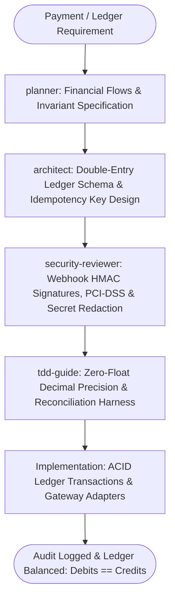

# Financial Engineering & Payments Master Suite Workflow

**MANDATE**: Enforce absolute financial precision, zero-loss idempotency, and audit compliance across payments, billing, and accounting systems by combining double-entry general ledgers, decimal integer arithmetic, and autonomous multi-agent verification.

---

## 1. Multi-Agent Delegation Pipeline



| Phase | Assigned Subagent | Primary Gate | Artifact Generated |
|-------|-------------------|--------------|---------------------|
| **1. Financial Flow Planning** | `planner` | Asset/Liability/Equity flow mapping, currency codes | `financial_spec.md`, flow diagram |
| **2. Double-Entry Architecture** | `architect` | ACID schema, $\sum \text{Debits} = \sum \text{Credits}$ | Ledger DDL, Transaction models |
| **3. Security & Webhook Audit** | `security-reviewer` | Stripe signature HMAC validation, zero stored PAN | Security audit report |
| **4. Arithmetic & Precision Test** | `tdd-guide` | Integer cents / Decimal tests, zero float rounding errors | `test_ledger.py`, `ledger.spec.ts` |
| **5. Reconciliation Gate** | Implementer | Daily balance reconciliation and audit logging | Ledger sign-off |

---

## 2. Step-by-Step Execution Lifecycle

### Step 1: Data Type Discipline (The Zero-Float Law)
1. **NEVER use IEEE 754 floating point numbers (`float`, `double`, `number` in JS) for money.**
2. Store all monetary amounts as **integer cents (e.g., $10.50 = 1050)** or high-precision Decimal types (`Decimal` in Python, `BigInt` / `decimal.js` in TypeScript, `NUMERIC(20, 4)` in SQL).
3. Always store ISO-4217 currency codes (`USD`, `EUR`, `VND`, `GBP`) alongside every amount.

### Step 2: Double-Entry General Ledger Engine
Every financial movement must create at least two balanced ledger entries within a single database transaction:
$$\sum \text{Debits} = \sum \text{Credits}$$

```typescript
// ponytail: Double-Entry Ledger Transaction Execution
import { db } from '@/lib/db';

interface LedgerPostRequest {
  idempotencyKey: string;
  description: string;
  currency: string;
  entries: {
    accountId: string;
    entryType: 'DEBIT' | 'CREDIT';
    amountCents: bigint;
  }[];
}

export async function postLedgerTransaction(req: LedgerPostRequest) {
  const totalDebits = req.entries
    .filter((e) => e.entryType === 'DEBIT')
    .reduce((acc, e) => acc + e.amountCents, 0n);

  const totalCredits = req.entries
    .filter((e) => e.entryType === 'CREDIT')
    .reduce((acc, e) => acc + e.amountCents, 0n);

  if (totalDebits !== totalCredits) {
    throw new Error(`Ledger imbalance: Debits (${totalDebits}) != Credits (${totalCredits})`);
  }

  return await db.$transaction(async (tx) => {
    const journal = await tx.journalEntry.create({
      data: {
        idempotencyKey: req.idempotencyKey,
        description: req.description,
        currency: req.currency,
      },
    });

    for (const entry of req.entries) {
      await tx.ledgerEntry.create({
        data: {
          journalEntryId: journal.id,
          accountId: entry.accountId,
          entryType: entry.entryType,
          amountCents: entry.amountCents,
        },
      });
    }

    return journal;
  });
}
```

### Step 3: Payment Gateway & Webhook Idempotency (Stripe)
1. **Signature Verification**: Always verify Stripe HMAC signature (`stripe-signature`) using the raw request body.
2. **Idempotency Guard**: Store processed webhook event IDs in Redis or database table before executing business logic. Return `200 OK` on duplicate deliveries without re-processing.

```typescript
// ponytail: Stripe Webhook Handler with HMAC & Idempotency
import Stripe from 'stripe';

export async function handleStripeWebhook(rawBody: string, signature: string, endpointSecret: string) {
  const stripe = new Stripe(process.env.STRIPE_SECRET_KEY!, { apiVersion: '2024-06-20' });
  const event = stripe.webhooks.constructEvent(rawBody, signature, endpointSecret);

  // Check event idempotency...
  if (event.type === 'payment_intent.succeeded') {
    const paymentIntent = event.data.object as Stripe.PaymentIntent;
    const amountReceivedCents = BigInt(paymentIntent.amount_received);
    // Record into double-entry ledger...
  }

  return { received: true };
}
```

### Step 4: Multi-Currency & FX Exchange Snapshots
1. Never convert currencies dynamically on historical records.
2. Always capture and store the fixed `exchange_rate` and `rate_timestamp` at the exact instant of the transaction.
