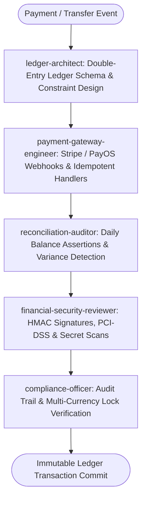

# Fintech Accounting Master Suite Workflow

**MANDATE**: Deliver mathematically exact, immutable, and compliant financial systems by enforcing double-entry bookkeeping constraints, zero floating-point calculations, cryptographic payment webhook signatures, dead-letter recovery queues, and automated reconciliation loops.

---

## 1. Multi-Agent Delegation Pipeline



| Phase | Assigned Subagent | Primary Gate | Artifact Generated |
|-------|-------------------|--------------|---------------------|
| **1. Ledger Architecture** | `ledger-architect` | Immutable journal entries (Sum Debits == Sum Credits) | SQL Ledger DDL |
| **2. Gateway Webhooks** | `payment-gateway-engineer` | Cryptographic signature validation (HMAC-SHA256) | Webhook controller |
| **3. Automated Reconciliation** | `reconciliation-auditor` | 0 variance between gateway balance and ledger | Recon report (`recon.json`) |
| **4. Security & Secret Gate** | `financial-security-reviewer` | PCI-DSS, zero raw card storage, safety_guard.py | Security audit report |
| **5. Compliance & Currency** | `compliance-officer` | Exchange rate locks & immutable audit trails | Compliance certificate |

---

## 2. Step-by-Step Execution Lifecycle

### Step 1: Double-Entry General Ledger Rules
1. **The Fundamental Law**: Every financial transaction must consist of at least two journal entries where:
   $$\sum \text{Debit Amounts} = \sum \text{Credit Amounts}$$
2. **Immutable Append-Only**: Updates and deletes are strictly banned (`REVOKE UPDATE, DELETE ON ledger_entries`). Corrections must be posted as offsetting adjustment entries.
3. **Exact Math**: Never use floating-point types (`FLOAT`, `DOUBLE`). All amounts must be stored as 64-bit integers (`BIGINT` representing cents/basis points) or `NUMERIC(20, 4)`.

```sql
-- PostgreSQL Double-Entry General Ledger Schema
CREATE TABLE IF NOT EXISTS ledger_accounts (
    id UUID PRIMARY KEY DEFAULT gen_random_uuid(),
    account_number VARCHAR(64) NOT NULL UNIQUE,
    account_type VARCHAR(32) NOT NULL, -- 'ASSET', 'LIABILITY', 'EQUITY', 'REVENUE', 'EXPENSE'
    currency VARCHAR(3) NOT NULL,
    created_at TIMESTAMPTZ NOT NULL DEFAULT NOW()
);

CREATE TABLE IF NOT EXISTS ledger_transactions (
    id UUID PRIMARY KEY DEFAULT gen_random_uuid(),
    idempotency_key VARCHAR(128) NOT NULL UNIQUE,
    description TEXT NOT NULL,
    posted_at TIMESTAMPTZ NOT NULL DEFAULT NOW()
);

CREATE TABLE IF NOT EXISTS ledger_entries (
    id UUID PRIMARY KEY DEFAULT gen_random_uuid(),
    transaction_id UUID NOT NULL REFERENCES ledger_transactions(id),
    account_id UUID NOT NULL REFERENCES ledger_accounts(id),
    entry_type VARCHAR(6) NOT NULL CHECK (entry_type IN ('DEBIT', 'CREDIT')),
    amount_cents BIGINT NOT NULL CHECK (amount_cents > 0),
    created_at TIMESTAMPTZ NOT NULL DEFAULT NOW()
);

CREATE INDEX IF NOT EXISTS idx_entries_account ON ledger_entries(account_id);
CREATE INDEX IF NOT EXISTS idx_entries_transaction ON ledger_entries(transaction_id);
```

### Step 2: Cryptographic Webhook Handlers (Stripe / PayOS)
1. **Signature Verification**: Verify raw request payload HMAC-SHA256 signature using the gateway webhook signing secret before parsing JSON.
2. **Idempotency Gate**: Store incoming webhook event ID in a deduplication table with a 72-hour TTL.
3. **Dead-Letter Queue (DLQ)**: If transaction posting fails, route payload to DLQ for automated retry with exponential backoff.

```typescript
// ponytail: Native Stripe Webhook Signature Verification
import crypto from 'node:crypto';

export function verifyStripeSignature(
  rawBody: string,
  signatureHeader: string,
  webhookSecret: string
): boolean {
  const parts = signatureHeader.split(',');
  const timestamp = parts.find((p) => p.startsWith('t='))?.split('=')[1];
  const signature = parts.find((p) => p.startsWith('v1='))?.split('=')[1];

  if (!timestamp || !signature) return false;

  // Prevent replay attacks (5 minute tolerance)
  const ageSeconds = Math.floor(Date.now() / 1000) - parseInt(timestamp, 10);
  if (ageSeconds > 300) return false;

  const signedPayload = `${timestamp}.${rawBody}`;
  const expectedSignature = crypto
    .createHmac('sha256', webhookSecret)
    .update(signedPayload)
    .digest('hex');

  return crypto.timingSafeEqual(
    Buffer.from(signature, 'hex'),
    Buffer.from(expectedSignature, 'hex')
  );
}
```

### Step 3: Multi-Currency Exchange Rate Lock
1. When booking cross-currency transactions, store the locked spot exchange rate (`rate_numerator`, `rate_denominator` as integers).
2. Never rely on dynamic realtime rate updates for already-settled transactions.

### Step 4: PayOS / Banking Webhook Integration
1. Validate Vietnamese payment gateway signatures (PayOS HMAC-SHA256 checksums).
2. Record bank transfer transaction codes to prevent duplicate credit entries.

```typescript
// ponytail: PayOS Checksum Verification - sort keys and compute HMAC-SHA256
export function verifyPayOSChecksum(data: Record<string, any>, signature: string, checksumKey: string): boolean {
  const sortedKeys = Object.keys(data).sort();
  const signString = sortedKeys.map((k) => `${k}=${data[k]}`).join('&');
  const computed = crypto.createHmac('sha256', checksumKey).update(signString).digest('hex');
  return computed === signature;
}
```

### Step 5: Automated Daily Reconciliation
1. Compare gateway settlement reports with internal ledger entries daily.
2. Flag any discrepancies > 0 cents immediately into a high-priority alert channel.

### Step 6: Chargeback & Refund Invariants
1. A refund creates reversing entries debiting Revenue / Returns and crediting Customer Cash / Receivables.
2. Ledger entries are never deleted or updated; an adjustment transaction is linked to the original `parent_transaction_id`.

```sql
-- Reversal Transaction Linking
ALTER TABLE ledger_transactions ADD COLUMN IF NOT EXISTS parent_transaction_id UUID REFERENCES ledger_transactions(id);
```

---

## 3. Subagent Execution Prompts

### Subagent: `ledger-architect`
```markdown
You are the Lead Fintech Ledger Architect. Design the financial ledger system:
1. Enforce strict double-entry bookkeeping invariants (Sum Debits == Sum Credits).
2. Configure database triggers or application transaction boundaries to prevent unbalanced entries.
3. Apply Ponytail Minimalism: use native PostgreSQL constraints over bloated third-party ledger engines.
```

### Subagent: `payment-gateway-engineer`
```markdown
You are the Payment Gateway Specialist. Implement webhook integrations:
1. Validate Stripe/PayOS HMAC-SHA256 webhook signatures against raw request bodies.
2. Implement idempotent event deduplication using Redis / PostgreSQL unique indexes.
3. Configure dead-letter queues (DLQ) for failed event recovery.
```

### Subagent: `reconciliation-auditor`
```markdown
You are the Financial Reconciliation Auditor. Build the daily recon engine:
1. Aggregate external gateway payment settlements and match against ledger entries.
2. Compute variances and generate reconciliation balance sheets.
3. Alert on mismatched transaction states or missing payouts.
```

### Subagent: `financial-security-reviewer`
```markdown
You are the Fintech Security Auditor. Verify PCI-DSS compliance:
1. Ensure zero plaintext credit card numbers (PAN) or CVVs touch application storage.
2. Audit timing-safe cryptographic signature comparisons (crypto.timingSafeEqual).
3. Execute safety_guard.py with 0 tolerance for leaked API secrets.
```

### Subagent: `compliance-officer`
```markdown
You are the Financial Compliance Officer. Verify audit trails:
1. Ensure all ledger entries have non-null actor IDs and immutable timestamp logs.
2. Verify multi-currency conversion transactions record the locked exchange rate.
3. Produce compliance audit reports.
```

---

## 4. Definition of Done (DoD) Checklist

- [ ] Double-entry ledger schema enforces debit-credit mathematical balance in ACID transactions.
- [ ] No floating-point data types used for monetary values (All BIGINT cents or NUMERIC).
- [ ] Payment gateway webhooks enforce timing-safe HMAC-SHA256 signature verification.
- [ ] Webhook processing is idempotent and protected against replay attacks.
- [ ] Automated reconciliation detects and reports zero balance discrepancies.
- [ ] Zero credit card data stored locally (Strict PCI-DSS compliance).
- [ ] `python scripts/safety_guard.py --scan-file .` executed clean.
