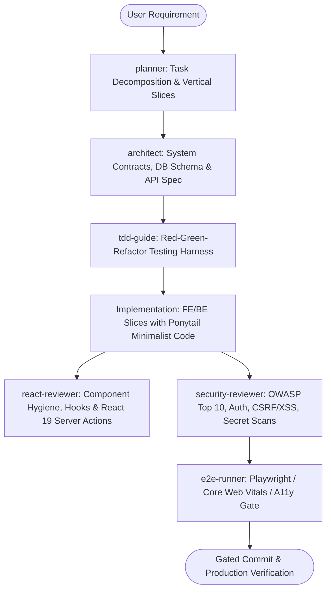

# Fullstack Web Master Suite Workflow

**MANDATE**: Build and deploy ultra-high-performance, accessible, and secure web applications by orchestrating React 19 Server Components, type-safe API boundaries, resilient database pools, and autonomous multi-agent pipelines.

---

## 1. Multi-Agent Delegation Pipeline



| Phase | Assigned Subagent | Primary Gate | Artifact Generated |
|-------|-------------------|--------------|---------------------|
| **1. Inception & Slicing** | `planner` | Vertical slice breakdown, zero over-abstraction | `task_list.md`, slice contracts |
| **2. Architecture & Data** | `architect` | Schema normalization, API typed contract | DTO definitions, Prisma/SQL schemas |
| **3. Test Harness** | `tdd-guide` | Red tests written prior to implementation | Unit & Integration test suites |
| **4. Component & UI Review** | `react-reviewer` | React 19 hygiene, Tailwind v4 tokens, a11y | Component audit report |
| **5. Security Audit** | `security-reviewer` | OWASP Top 10, Cookie flags, Secret scanning | Security sign-off (`safety_guard.py`) |
| **6. Integration Verification** | `e2e-runner` | Core Web Vitals, Playwright smoke tests | E2E test results & CWV report |

---

## 2. Step-by-Step Execution Lifecycle

### Step 1: Inception & Domain Contract Planning
1. **Vertical Slicing**: Decompose requirements into end-to-end vertical slices (DB migration -> Service -> API Endpoint -> Client Component).
2. **Contract-First API Design**: Define TypeScript DTOs and Zod schemas shared between frontend and backend.
3. **Ponytail Verification**: Apply 7-rung solution ladder before introducing any external dependency or abstraction.

### Step 2: Backend Architecture & Data Layer
1. **Database Engine**: Configure PostgreSQL with connection pooling (`pgbouncer` or native pooler) and Prisma / Kysely ORM.
2. **Caching & Ephemeral State**: Implement Redis for session caching, rate-limiting counters, and idempotent background jobs.
3. **Resilient Endpoints**:
   - Wrap mutations in database transactions with isolation level guards.
   - Enforce structured error payloads: `{ success: false, error: { code, message, details } }`.

```typescript
// ponytail: Native Error Handler - single catch boundary, upgrade to custom registry when multi-service
export async function handleApiRoute(handler: () => Promise<Response>): Promise<Response> {
  try {
    return await handler();
  } catch (err: unknown) {
    const message = err instanceof Error ? err.message : 'Internal Server Error';
    return Response.json({ success: false, error: { code: 'INTERNAL_ERROR', message } }, { status: 500 });
  }
}
```

### Step 3: Frontend Presentation & React 19 Primitives
1. **Server vs Client Boundary**:
   - Default to Server Components (`RSC`) for data-fetching and static layout trees.
   - Use Client Components (`"use client"`) strictly at leaf interaction boundaries.
2. **React 19 Actions & Optimistic State**:
   - Utilize `useActionState`, `useFormStatus`, and `useOptimistic` for seamless form mutations.
3. **Styling & Motion**:
   - Use Tailwind CSS v4 CSS variables for theme tokens (`oklch` color spaces).
   - Use GSAP with ScrollTrigger for compositor-friendly animations (`transform`, `opacity`).
4. **Accessibility (WCAG 2.2 AA/AAA)**:
   - Ensure color contrast ratios >= 4.5:1 (normal text) and >= 3:1 (large text/UI elements).
   - Ensure full keyboard accessibility with visible focus rings (`focus-visible:ring-2`).

### Step 4: Defense-in-Depth Security Verification
1. **Authentication & Session Cookies**:
   - Secure cookies configured with `HttpOnly; Secure; SameSite=Strict; Path=/`.
2. **XSS & Injection Defense**:
   - Sanitize all external and user-supplied HTML via vetted parser.
   - Parameterize all database SQL queries — zero string interpolation.
3. **Secret Scan Gate**:
   - Execute `python scripts/safety_guard.py --scan-file .` prior to any git commit.

### Step 5: Autonomous Review & E2E Validation
1. Dispatch `react-reviewer` to audit hook dependencies, memoization, and layout shift risks.
2. Dispatch `security-reviewer` to verify authorization checks on every Server Action and API endpoint.
3. Run `e2e-runner` using Playwright to execute headless browser flows.
4. Verify Core Web Vitals:
   - **LCP** (Largest Contentful Paint) < 2.5s
   - **INP** (Interaction to Next Paint) < 200ms
   - **CLS** (Cumulative Layout Shift) < 0.1

---

## 3. Subagent Execution Prompts

### Subagent: `planner`
```markdown
You are the Lead Fullstack Planner. Decompose the requirement into atomic vertical slices:
1. Define Database Migration & Entity Models (PostgreSQL + Prisma/Kysely).
2. Define API Contract & Zod Validation Schemas.
3. Define React 19 Server/Client Component Hierarchy.
4. Apply the Ponytail Minimalist Directive (no unnecessary abstractions, stdlib first).
Output the execution plan in task_list.md.
```

### Subagent: `architect`
```markdown
You are the System Architect. Design the unified domain models, database DDL, and API specifications:
1. Ensure normalized SQL schema with foreign key indexes and timestamp triggers.
2. Produce shared TypeScript interfaces for Request/Response payloads.
3. Enforce Redis cache-aside invalidation strategies for mutating operations.
```

### Subagent: `tdd-guide`
```markdown
You are the TDD Guide. Enforce Red-Green-Refactor testing:
1. Write integration test suite for API endpoints using Vitest / Supertest.
2. Assert boundary cases (invalid JSON, expired tokens, missing required fields).
3. Ensure all tests fail initially (RED) before greenlighting implementation.
```

### Subagent: `react-reviewer`
```markdown
You are the React 19 & Frontend Reviewer. Review all frontend code against:
1. Proper RSC containment (no "use client" on static components).
2. React 19 form actions (useActionState, useOptimistic).
3. Tailwind v4 token compliance and zero layout shift (CLS < 0.1).
4. WCAG 2.2 AA accessibility (ARIA roles, keyboard trap prevention).
```

### Subagent: `security-reviewer`
```markdown
You are the Application Security Specialist. Perform an exhaustive OWASP Top 10 audit:
1. Verify parameterization of all SQL queries.
2. Audit cookie attributes (HttpOnly, Secure, SameSite=Strict).
3. Scan codebase for hardcoded credentials using safety_guard.py.
```

### Subagent: `e2e-runner`
```markdown
You are the E2E Automation Specialist. Run Playwright synthetic user journeys:
1. Verify authentication lifecycle (login, session persistence, logout).
2. Assert Core Web Vitals (LCP < 2.5s, CLS < 0.1, INP < 200ms).
3. Run automated accessibility scans with axe-core.
```

---

## 4. Production Database Schema Example

```sql
-- PostgreSQL Enterprise Core Schema
CREATE EXTENSION IF NOT EXISTS "uuid-ossp";
CREATE EXTENSION IF NOT EXISTS "pgcrypto";

CREATE TABLE IF NOT EXISTS users (
    id UUID PRIMARY KEY DEFAULT gen_random_uuid(),
    email VARCHAR(255) NOT NULL UNIQUE,
    password_hash VARCHAR(255) NOT NULL,
    display_name VARCHAR(100) NOT NULL,
    role VARCHAR(32) NOT NULL DEFAULT 'member',
    is_active BOOLEAN NOT NULL DEFAULT true,
    created_at TIMESTAMPTZ NOT NULL DEFAULT NOW(),
    updated_at TIMESTAMPTZ NOT NULL DEFAULT NOW()
);

CREATE TABLE IF NOT EXISTS user_sessions (
    id UUID PRIMARY KEY DEFAULT gen_random_uuid(),
    user_id UUID NOT NULL REFERENCES users(id) ON DELETE CASCADE,
    refresh_token_hash VARCHAR(255) NOT NULL UNIQUE,
    ip_address INET,
    user_agent TEXT,
    expires_at TIMESTAMPTZ NOT NULL,
    created_at TIMESTAMPTZ NOT NULL DEFAULT NOW()
);

CREATE INDEX IF NOT EXISTS idx_users_email ON users(email);
CREATE INDEX IF NOT EXISTS idx_sessions_user_id ON user_sessions(user_id);
CREATE INDEX IF NOT EXISTS idx_sessions_expires_at ON user_sessions(expires_at);
```

---

## 5. Definition of Done (DoD) Checklist

- [ ] All API contracts typed and validated via Zod / native schemas at trust boundaries.
- [ ] React 19 Server Components utilized without unnecessary `"use client"` directives.
- [ ] Database queries parameterized with connection pooling active.
- [ ] Redis caching applied to high-read endpoints with cache invalidation keys defined.
- [ ] Security audit passed (CSRF tokens on mutating routes, SameSite cookies, XSS sanitization).
- [ ] `python scripts/safety_guard.py --scan-file .` executed clean with 0 secret leaks.
- [ ] Core Web Vitals green on Lighthouse / Playwright synthetic run.
- [ ] Subagent review sign-offs complete (`planner`, `architect`, `tdd-guide`, `security-reviewer`).
