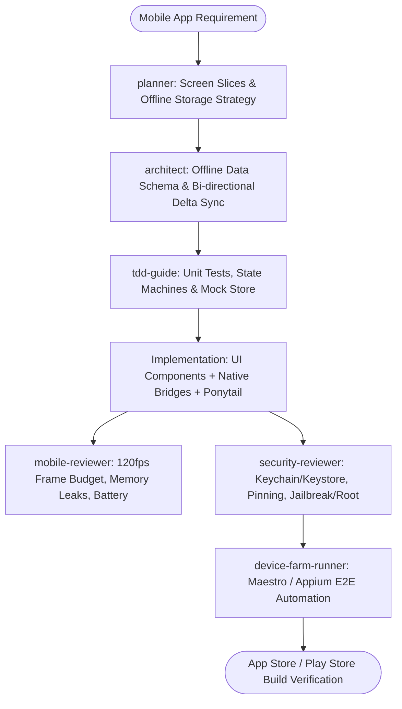

# Mobile Ecosystem Master Suite Workflow

**MANDATE**: Engineer ultra-smooth (120fps), secure, and resilient mobile applications across iOS, Android, and HarmonyOS using offline-first data architectures, native platform primitives, and autonomous testing pipelines.

---

## 1. Multi-Agent Delegation Pipeline



| Phase | Assigned Subagent | Primary Gate | Artifact Generated |
|-------|-------------------|--------------|---------------------|
| **1. UI Slicing & Storage Plan** | `planner` | Screen flows & offline-first storage plan | `mobile_plan.md`, screen maps |
| **2. Local Data Architecture** | `architect` | SQLite / WatermelonDB schema with delta sync | Entity models, sync protocol |
| **3. Test & State Harness** | `tdd-guide` | Red tests for reducers, sync engines & APIs | Unit & integration test suites |
| **4. Performance & Memory Audit** | `mobile-reviewer` | 120fps animation budget, no memory leaks | Performance profiling report |
| **5. Mobile Security Gate** | `security-reviewer` | Keychain/Keystore, SSL Pinning, Biometrics | Security compliance audit |
| **6. Device Automation Gate** | `device-farm-runner` | Maestro / Detox E2E tests across devices | Multi-device execution report |

---

## 2. Step-by-Step Execution Lifecycle

### Step 1: Offline-First Data Modeling & Sync
1. **Local Relational Database**: Set up local SQLite / WatermelonDB / Room / SwiftData with versioned migrations.
2. **Delta Sync Protocol**: Implement bi-directional synchronization tracking `created_at`, `updated_at`, `deleted_at`, and `sync_version`.
3. **Optimistic Mutations**: Apply mutations to local state immediately; queue mutations in an offline outbox for background retry.

```typescript
// ponytail: Minimalist Offline Mutation Queue - local queue with exponential backoff
export interface QueuedMutation {
  id: string;
  type: string;
  payload: Record<string, any>;
  attempts: number;
  createdAt: number;
}

export async function processOutbox(
  queue: QueuedMutation[],
  apiExecutor: (item: QueuedMutation) => Promise<boolean>
): Promise<QueuedMutation[]> {
  const remaining: QueuedMutation[] = [];
  for (const item of queue) {
    try {
      const ok = await apiExecutor(item);
      if (!ok) remaining.push({ ...item, attempts: item.attempts + 1 });
    } catch {
      remaining.push({ ...item, attempts: item.attempts + 1 });
    }
  }
  return remaining;
}
```

### Step 2: Cross-Platform & Native Component Architecture
1. **React Native**: Use New Architecture (Fabric Renderer, TurboModules, JSI); avoid unnecessary bridge serialization.
2. **SwiftUI / Jetpack Compose / ArkTS**: Write idiomatic declarative UI with unidirectional data flow (MVI / Redux / Riverpod).
3. **Frame-Rate Budget (120fps)**:
   - Offload heavy calculations to background threads (Web Workers / Native Isolates / Worklets).
   - Use `react-native-reanimated` or native declarative animation primitives.

### Step 3: Hardware & Security Primitives
1. **Biometric Authentication**: Integrate FaceID / TouchID / BiometricPrompt via hardware KeyStore / Keychain.
2. **Certificate Pinning**: Pin TLS public keys (HPKP or SPKI hashes) in network client to mitigate MitM attacks.
3. **Zero Insecure Storage**: Ban plaintext AsyncStorage or SharedPreferences for tokens; use SecureStore or EncryptedSharedPreferences.

### Step 4: Background Workers & Deep Linking
1. **Background Tasks**: Configure iOS `BGTaskScheduler` and Android `WorkManager` for opportunistic sync.
2. **Universal Links & App Links**: Handle deep links with strict route validation and fallback paths.

### Step 5: Autonomous Quality & Device Verification
1. Dispatch `mobile-reviewer` to audit render performance, scroll list virtualization, and image memory caches.
2. Dispatch `security-reviewer` to verify obfuscation (ProGuard / R8), root/jailbreak detection, and secure enclave storage.
3. Run `device-farm-runner` to execute Maestro flows across multiple screen resolutions and OS versions.

---

## 3. Subagent Execution Prompts

### Subagent: `planner`
```markdown
You are the Lead Mobile Architect & Planner. Break down the mobile requirements:
1. Map screen flows, navigation stacks, and state machine transitions.
2. Define the local storage entities (SQLite/Room/SwiftData) and sync boundaries.
3. Apply Ponytail Minimalism: favor native platform APIs over redundant npm/cocoapods libraries.
```

### Subagent: `architect`
```markdown
You are the Mobile Data Architect. Design the offline-first sync engine:
1. Create relational database DDL with soft deletes and sync timestamps.
2. Define conflict resolution policies (Client-Wins, Server-Wins, or Last-Write-Wins with vector clocks).
3. Specify network retry policies with jittered exponential backoff.
```

### Subagent: `tdd-guide`
```markdown
You are the Mobile TDD Guide. Establish test harnesses before implementation:
1. Write unit tests for local database queries, migrations, and reducer states.
2. Mock network offline states and assert optimistic UI updates roll back gracefully on server errors.
3. Test edge cases: low memory warnings, background suspension, and network timeout.
```

### Subagent: `mobile-reviewer`
```markdown
You are the Mobile Performance Specialist. Audit the codebase against:
1. 120fps animation consistency (zero JS thread drops during navigation).
2. Large list memory management (FlashList / VirtualizedList / LazyColumn).
3. Image memory caches and SVG rendering overhead.
```

### Subagent: `security-reviewer`
```markdown
You are the Mobile Security Auditor. Verify:
1. All auth tokens stored in Secure KeyStore / iOS Keychain / EncryptedFile.
2. Network calls enforce TLS certificate pinning with backup pin configurations.
3. Deep link URIs (Universal Links / App Links) validate domain origins and payloads.
```

### Subagent: `device-farm-runner`
```markdown
You are the Mobile E2E Automation Specialist. Execute Maestro test flows:
1. Run automated cross-platform test flows on iOS and Android emulators.
2. Assert offline mode transitions, background sync triggers, and biometric mock prompts.
3. Record test logs and performance metrics across physical screen sizes.
```

---

## 4. Maestro E2E Test Flow Blueprint

```yaml
# .maestro/login_and_sync_flow.yaml
appId: com.vanguard.mobileapp
---
- launchApp:
    clearState: true
- assertVisible: "Welcome to Vanguard"
- tapOn: "Sign In"
- inputText: "engineer@vanguard.io"
- tapOn: "Password"
- inputText: "P@ssword1234!"
- tapOn: "Submit"
- assertVisible: "Dashboard"
- tapOn: "Create Note"
- inputText: "Offline Testing Note"
- tapOn: "Save"
- assertVisible: "Offline Testing Note"
# Simulate offline toggle
- setAirplaneMode: true
- tapOn: "Create Note"
- inputText: "Airplane Mode Note"
- tapOn: "Save"
- assertVisible: "Airplane Mode Note"
- setAirplaneMode: false
```

---

## 5. SQLite Offline Schema & Bi-directional Delta Sync

```sql
-- SQLite Local Mobile Storage Schema
CREATE TABLE IF NOT EXISTS notes (
    id TEXT PRIMARY KEY NOT NULL,
    title TEXT NOT NULL,
    content TEXT NOT NULL,
    is_pinned INTEGER NOT NULL DEFAULT 0,
    is_deleted INTEGER NOT NULL DEFAULT 0,
    sync_status TEXT NOT NULL DEFAULT 'synced', -- 'synced', 'created', 'updated', 'deleted'
    updated_at INTEGER NOT NULL,
    server_version INTEGER NOT NULL DEFAULT 0
);

CREATE TABLE IF NOT EXISTS sync_outbox (
    mutation_id TEXT PRIMARY KEY NOT NULL,
    table_name TEXT NOT NULL,
    record_id TEXT NOT NULL,
    action TEXT NOT NULL, -- 'INSERT', 'UPDATE', 'DELETE'
    payload JSON NOT NULL,
    created_at INTEGER NOT NULL,
    retry_count INTEGER NOT NULL DEFAULT 0
);

CREATE INDEX IF NOT EXISTS idx_notes_sync_status ON notes(sync_status);
CREATE INDEX IF NOT EXISTS idx_outbox_created_at ON sync_outbox(created_at);
```

---

## 6. Definition of Done (DoD) Checklist

- [ ] Relational offline-first database migrations tested and verified.
- [ ] Optimistic mutations and background sync outbox functional under offline flight mode simulation.
- [ ] 120fps frame rates maintained on lists and transitions (Zero dropped frames in profiler).
- [ ] Sensitive tokens exclusively stored in Keychain / Secure Enclave / KeyStore.
- [ ] SSL Certificate pinning active on all network clients.
- [ ] Maestro / Appium E2E smoke tests passing on iOS, Android, and HarmonyOS targets.
- [ ] `python scripts/safety_guard.py --scan-file .` clean with 0 hardcoded keys.
