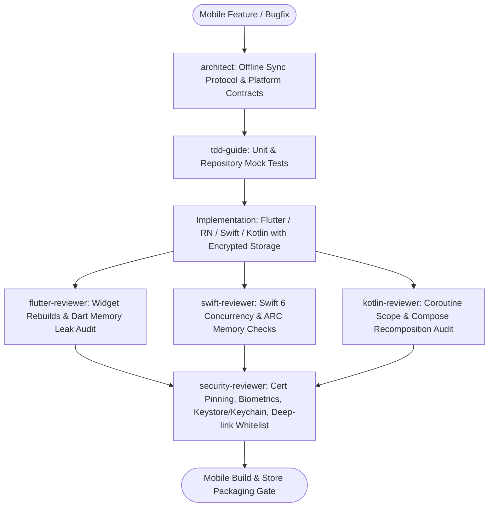

# Mobile Ecosystem Master Suite Workflow

**MANDATE**: Engineer high-performance, resilient, and offline-first mobile applications across cross-platform and native ecosystems with ironclad platform security and subagent validation.

---

## 1. Multi-Agent Delegation Pipeline



| Phase | Assigned Subagent | Primary Gate | Artifact Generated |
|-------|-------------------|--------------|---------------------|
| **1. Sync & Schema Plan** | `architect` | Offline SQLite schema, conflict resolution strategy | Schema definitions, Sync contract |
| **2. Test Suite** | `tdd-guide` | Red-Green unit tests on repositories and state reducers | Repository & Mock test suites |
| **3. Platform Code Review** | `flutter-reviewer` / `swift-reviewer` / `kotlin-reviewer` | Memory leaks, thread safety, 60/120fps UI smoothness | Platform review report |
| **4. Mobile Security Audit** | `security-reviewer` | Certificate pinning, Keychain/Keystore, Deep links | Mobile security audit checklist |

---

## 2. Step-by-Step Execution Lifecycle

### Step 1: Offline-First SQLite Synchronization Architecture
1. **Local-First Storage**: Store all user mutations locally in SQLite (Drift, Room, GRDB, or WatermelonDB) prior to network attempts.
2. **Sync Outbox Pattern**:
   - Save pending actions in an `outbox` queue with incrementing logical timestamps.
   - Background worker drains the outbox when connectivity is restored.
3. **Conflict Resolution**: Apply deterministic Last-Write-Wins (LWW) or CRDT field merges.

```dart
// ponytail: Offline-First Mutation - insert local first, enqueue sync task
Future<void> createNote(String title, String content) async {
  final note = Note(
    id: uuid.v4(),
    title: title,
    content: content,
    updatedAt: DateTime.now().toUtc(),
    isSynced: false,
  );
  await localDb.notesDao.insertNote(note);
  await syncQueue.enqueue(SyncTask(entity: 'notes', id: note.id, action: SyncAction.create));
}
```

### Step 2: Encrypted Storage & Biometric Authentication
1. **Hardware-Backed Storage**:
   - **iOS**: Save cryptographic keys and auth tokens in iOS Keychain with `kSecAttrAccessibleAfterFirstUnlock`.
   - **Android**: Use Android Keystore with `MasterKeys` / `EncryptedSharedPreferences` backed by Hardware Security Module (HSM) / TEE.
2. **Biometric Authentication**:
   - Local authentication (FaceID / Fingerprint) gates access to the decrypt key; never bypass biometric validation via client-side boolean flags.

### Step 3: Network Security & Certificate Pinning
1. **TLS / Certificate Pinning**: Pin public key Subject Public Key Info (SPKI) hashes (`sha256/hash...`) to eliminate MITM proxy vulnerabilities.
2. **Deep-Link Validation**:
   - Strictly validate URL schemes and Universal Links / Android App Links.
   - Reject untrusted navigation targets via an explicit whitelist.

### Step 4: Platform-Specific Idiomatic Reviews
1. **Flutter**: Audit for unnecessary `setState()` rebuilds, unclosed Streams/Controllers, and excessive paint repaints.
2. **iOS (Swift)**: Enforce Swift 6 strict concurrency (`@Sendable`, `MainActor`), prevent retain cycles in closures (`[weak self]`).
3. **Android (Kotlin)**: Audit Jetpack Compose recomposition scopes, ensure coroutines are scoped to `viewModelScope` / `lifecycleScope`.

---

## 3. Definition of Done (DoD) Checklist

- [ ] All data mutations written to local SQLite database first (offline-first architecture).
- [ ] Cryptographic tokens and credentials stored in Keychain / Keystore (zero raw SharedPreferences/UserDefaults).
- [ ] Certificate pinning enabled on all production API base URLs.
- [ ] Biometric authentication properly gates access to sensitive flows.
- [ ] Universal Links / App Links verified against explicit route whitelists.
- [ ] Subagent review passed (`flutter-reviewer`, `swift-reviewer`, `kotlin-reviewer`, `security-reviewer`).
- [ ] `python scripts/safety_guard.py --scan-file .` clean with 0 secrets.
