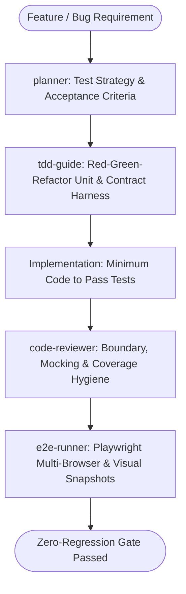

# QA Testing & Continuous Quality Master Suite Workflow

**MANDATE**: Enforce absolute software correctness, regression immunity, and zero-defect deployments by combining Test-Driven Development (TDD), multi-layer test pyramids, automated visual regression, and autonomous subagent delegation.

---

## 1. Multi-Agent Delegation Pipeline



| Phase | Assigned Subagent | Primary Gate | Artifact Generated |
|-------|-------------------|--------------|---------------------|
| **1. Strategy & Criteria** | `planner` | Acceptance criteria (Gherkin/BDD specs) | `test_plan.md`, test matrix |
| **2. TDD Harness (RED)** | `tdd-guide` | Red tests failing strictly for intended behavior | `*.spec.ts`, `test_*.py` |
| **3. Implementation (GREEN)** | Implementer | Shortest working diff, Ponytail minimalism | Source code changes |
| **4. Code & Isolation Review** | `code-reviewer` | Mock isolation, $\ge 80\%$ branch coverage | Test review report |
| **5. E2E & Visual Verification** | `e2e-runner` | Playwright flows, visual diffs $< 0.1\%$ | E2E trace, HTML report |

---

## 2. Step-by-Step Execution Lifecycle

### Step 1: Acceptance Criteria & Test Strategy
1. Formulate testable assertions for every user story before touching production code.
2. Structure tests following the Arrange-Act-Assert (AAA) or Given-When-Then pattern.
3. Categorize tests into the Testing Pyramid: 70% Unit, 20% Integration, 10% E2E.

### Step 2: Test-Driven Development (Red-Green-Refactor)
1. **RED**: Write the failing test first. Verify that it fails for the expected reason (not a syntax or import error).
2. **GREEN**: Write the minimal possible code to pass the test.
3. **REFACTOR**: Eliminate duplication and enforce clean boundaries while keeping all tests green.

```typescript
// ponytail: AAA Pattern Unit Test with deterministic assertions
import { describe, it, expect } from 'vitest';

export function calculateCartTotal(items: { price: number; quantity: number }[], discountPercent = 0): number {
  const subtotal = items.reduce((sum, item) => sum + item.price * item.quantity, 0);
  const discount = (subtotal * discountPercent) / 100;
  return Math.round((subtotal - discount) * 100) / 100;
}

describe('calculateCartTotal', () => {
  it('correctly calculates total with quantity and discount', () => {
    // Arrange
    const cart = [
      { price: 29.99, quantity: 2 },
      { price: 10.00, quantity: 1 },
    ];
    // Act
    const total = calculateCartTotal(cart, 10);
    // Assert
    expect(total).toBe(62.98);
  });

  it('handles empty carts gracefully', () => {
    expect(calculateCartTotal([])).toBe(0);
  });
});
```

### Step 3: End-to-End (E2E) & Visual Regression with Playwright
1. Execute multi-browser tests (Chromium, Firefox, WebKit) across desktop and mobile viewports.
2. Test critical user journeys: Authentication, Onboarding, Checkout, and Settings mutations.
3. Capture full-page visual regression screenshots with strict pixel thresholds.

```typescript
// ponytail: Playwright E2E Flow with deterministic network waits
import { test, expect } from '@playwright/test';

test('user can complete checkout journey', async ({ page }) => {
  await page.goto('/catalog');
  await page.locator('[data-testid="add-to-cart-btn"]').first().click();
  await expect(page.locator('[data-testid="cart-badge"]')).toHaveText('1');

  await page.goto('/checkout');
  await page.fill('input[name="email"]', 'test@example.com');
  await page.click('button[type="submit"]');

  await expect(page.locator('[data-testid="order-confirmation"]')).toBeVisible({ timeout: 5000 });
});
```

### Step 4: Contract & API Schema Testing
1. Validate API responses against shared Zod / Pydantic schemas.
2. Run contract regression suites to prevent breaking downstream clients.

### Step 5: Accessibility & Performance Gates
1. Run `@axe-core/playwright` automated checks on every route.
2. Assert zero critical/serious accessibility violations (WCAG 2.2 AA).
3. Validate Core Web Vitals (LCP $< 2.5\text{s}$, CLS $< 0.1$, INP $< 200\text{ms}$).
