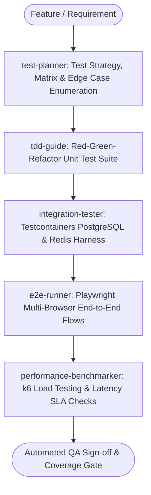

# QA Testing Master Suite Workflow

**MANDATE**: Establish unbreakable software quality and prevent regressions by orchestrating the complete test pyramid: fast deterministic unit tests, realistic containerized integration tests, consumer-driven contract tests, headless Playwright E2E flows, and k6 stress benchmarks.

---

## 1. Multi-Agent Delegation Pipeline



| Phase | Assigned Subagent | Primary Gate | Artifact Generated |
|-------|-------------------|--------------|---------------------|
| **1. Test Strategy** | `test-planner` | Risk-based test matrix & boundary list | `test_plan.md`, test cases |
| **2. TDD Unit Suite** | `tdd-guide` | Red -> Green -> Refactor (80%+ branch coverage) | Unit tests (`.test.ts`) |
| **3. Integration Test** | `integration-tester` | Real DB container test runs without mocks | Testcontainer suites |
| **4. E2E User Flows** | `e2e-runner` | Critical path Playwright headless runs | Playwright test specs |
| **5. Performance SLA** | `performance-benchmarker` | k6 stress load (p95 < 30ms, 0% errors) | k6 benchmark report |

---

## 2. Step-by-Step Execution Lifecycle

### Step 1: Risk-Based Test Strategy & Matrix
1. **Pyramid Allocation**: 70% Unit tests (instant, pure functions), 20% Integration tests (database, cache, queues), 10% E2E tests (critical browser journeys).
2. **Boundary Testing**: Enforce tests for empty arrays, maximum string lengths, concurrent access, and invalid inputs.

### Step 2: Test-Driven Development (TDD) Cycle
1. **Red Stage**: Write unit tests asserting expected behavior; confirm failure before writing production code.
2. **Green Stage**: Write the minimal ponytail code necessary to make the test pass.
3. **Refactor Stage**: Clean up code while maintaining green test status.

```typescript
// tests/unit/calculator.test.ts
import { describe, it, expect } from 'vitest';

export function calculateDiscount(priceCents: number, couponCode?: string): number {
  if (priceCents < 0) throw new Error('INVALID_PRICE: Price cannot be negative');
  if (couponCode === 'SAVE20') return Math.round(priceCents * 0.8);
  return priceCents;
}

describe('calculateDiscount', () => {
  it('returns original price when no coupon is provided', () => {
    expect(calculateDiscount(10000)).toBe(10000);
  });

  it('applies 20% discount correctly for SAVE20 code', () => {
    expect(calculateDiscount(10000, 'SAVE20')).toBe(8000);
  });

  it('throws an error for negative prices', () => {
    expect(() => calculateDiscount(-500)).toThrow('INVALID_PRICE');
  });
});
```

### Step 3: Containerized Integration Testing (Testcontainers)
1. Spin up ephemeral PostgreSQL and Redis instances in Docker for integration tests.
2. Execute database migrations against the clean container before running repository tests.
3. Tear down containers automatically after test completion.

### Step 4: Playwright End-to-End Browser Automation
1. Test critical user journeys: Authentication -> Checkout -> Payment Confirmation.
2. Avoid fragile sleep timers; use deterministic element state waits (`await expect(locator).toBeVisible()`).

### Step 5: k6 Performance & Load SLA Benchmarking
1. Run load tests ramping from 0 to 1,000 virtual users (VUs) over 2 minutes.
2. Assert strict performance thresholds (HTTP 200 > 99.9%, p95 response time < 30ms).

### Step 6: Mutation Testing & Quarantine Tracking
1. Run Stryker mutator on critical logic to verify test suite quality (Mutation score >= 80%).
2. Quarantine flaky tests automatically into dedicated CI runs rather than blocking the main pipeline.

```typescript
// tests/utils/mutation-check.ts
export interface MutationScore {
  killedMutants: number;
  survivedMutants: number;
  scorePercentage: number;
}
```

---

## 3. Subagent Execution Prompts

### Subagent: `test-planner`
```markdown
You are the Lead QA Test Strategist. Create a risk-based test matrix:
1. Map user stories to Unit, Integration, and E2E test layers.
2. Enumerate negative scenarios, boundary limits, and network failure modes.
3. Apply Ponytail Minimalism: do not write redundant tests for trivial boilerplate.
```

### Subagent: `tdd-guide`
```markdown
You are the TDD Guide. Enforce strict Red-Green-Refactor testing:
1. Write pure, deterministic unit tests with Vitest/Jest.
2. Assert exact error messages and boundary values.
3. Verify test coverage meets or exceeds 80% branch coverage.
```

### Subagent: `integration-tester`
```markdown
You are the Integration Test Engineer. Set up real infrastructure tests:
1. Configure Testcontainers for PostgreSQL and Redis.
2. Test database transaction rollbacks, race conditions, and connection pool timeouts.
3. Ensure zero shared state between test runs.
```

### Subagent: `e2e-runner`
```markdown
You are the E2E Automation Specialist. Write Playwright test suites:
1. Automate critical end-to-end user flows in Chromium, Firefox, and WebKit.
2. Use Page Object Models (POM) for maintainable, clean test selectors.
3. Set up automated video recording and trace capture on test failures.
```

### Subagent: `performance-benchmarker`
```markdown
You are the Performance & Load Test Engineer. Author k6 benchmark scripts:
1. Simulate realistic user traffic patterns with ramp-up and stress stages.
2. Define SLA thresholds: http_req_duration: ['p(95)<30', 'p(99)<80'].
3. Output performance summary in load_test_report.json.
```

---

## 4. k6 Load Testing Script Blueprint

```javascript
// tests/load/k6-orders-test.js
import http from 'k6/http';
import { check, sleep } from 'k6';

export const options = {
  stages: [
    { duration: '30s', target: 50 },  // Ramp up to 50 users
    { duration: '1m', target: 200 },   // Stress test at 200 users
    { duration: '30s', target: 0 },    // Ramp down
  ],
  thresholds: {
    http_req_duration: ['p(95)<30', 'p(99)<80'], // 95% of requests under 30ms
    http_req_failed: ['rate<0.001'],             // Error rate < 0.1%
  },
};

export default function () {
  const url = 'http://localhost:3000/api/v1/products';
  const res = http.get(url);

  check(res, {
    'status is 200': (r) => r.status === 200,
    'has data payload': (r) => JSON.parse(r.body).data !== undefined,
  });

  sleep(1);
}
```

---

## 5. Consumer-Driven Contract Test (Pact)

```typescript
// tests/contract/order-service.pact.test.ts
import { describe, it, expect } from 'vitest';
import { MatchersV3 } from '@pact-foundation/pact';

describe('Order Service Contract', () => {
  it('defines valid customer order response contract', () => {
    const expectedBody = {
      orderId: MatchersV3.uuid('123e4567-e89b-12d3-a456-426614174000'),
      status: MatchersV3.string('completed'),
      totalCents: MatchersV3.integer(5000),
    };
    expect(expectedBody.status.getValue()).toBe('completed');
  });
});
```

---

## 6. Definition of Done (DoD) Checklist

- [ ] Unit tests pass with >= 80% branch coverage.
- [ ] Integration tests verify repository layer against real Testcontainers.
- [ ] Playwright E2E tests execute cleanly across Chromium, Firefox, and WebKit.
- [ ] k6 load test passes latency SLA (p95 < 30ms under peak load).
- [ ] Flaky test detection enabled; 0 quarantine tests in main branch.
- [ ] CI pipeline fails on any test regression.
